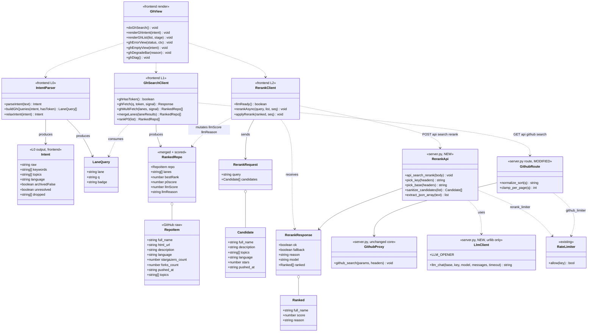
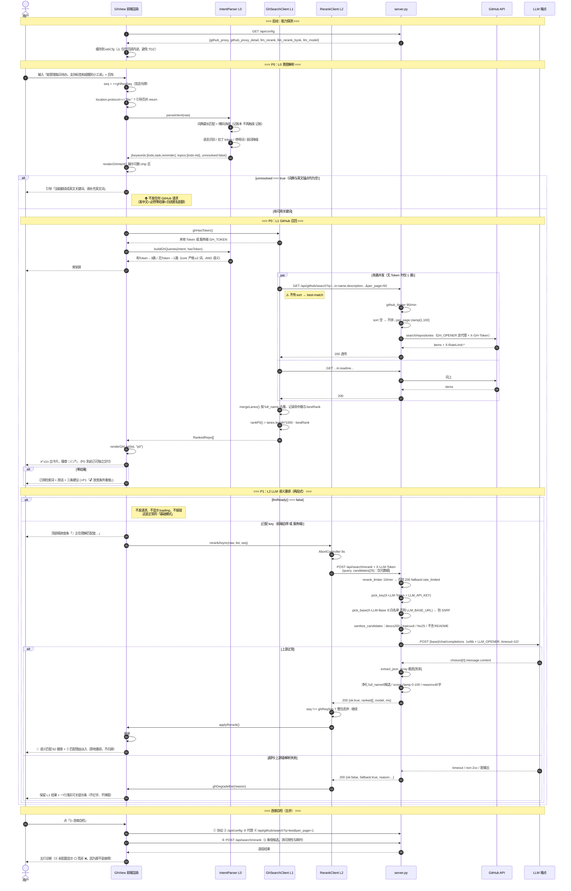
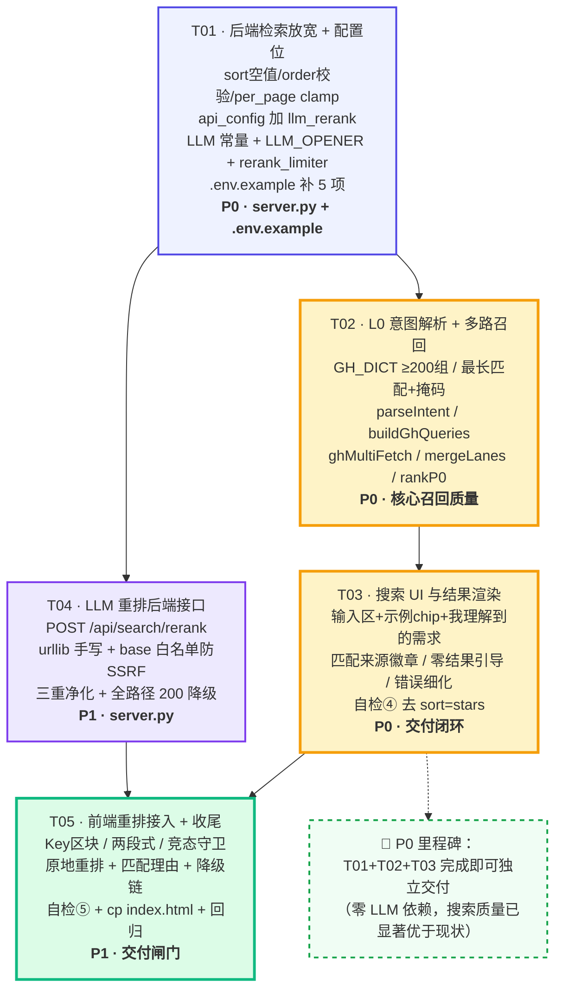

# 系统设计 · 需求 B：GitHub 搜索重做为「按功能语义匹配」

> 文档类型：系统设计 + 任务分解 ｜ 撰写：架构师 高见远 ｜ 日期：2026-08-07
> 上游输入：`docs/prd-github-semantic-search.md`（PM 许清楚）
> 需求编号：**B** ｜ 与需求 A（待办目标化）**完全独立，可并行开发**
> 主理人已拍板决策：**P0 零 LLM 依赖也要显著变好**、**P1 才加 LLM 重排**、**Key 走前端 localStorage + `X-LLM-Token` 透传**、**`urllib` 手写、禁引第三方包**、**降级一律 200**

---

## Part A · 系统设计

### 1. 实现方案（Implementation Approach）

#### 1.1 难点分析

| # | 难点 | 本质 | 对策 |
|---|---|---|---|
| **D1** | ⭐ **GitHub 仓库搜索的自由词是 AND 语义** | 现状 `buildQuery` 产出 `todo (task OR cli OR manager) note (...)`（L2610），把一堆词 AND 在一起 → **词越多召回越少**，且 GitHub repo search 对括号/OR 的解析不稳定（PRD R4）。这是"搜不出来"的隐藏元凶，比 R1/R2 更致命 | **核心关键词严格限 2 个**（至多 3）。多余的语义信息不进自由词，而是转化为 **`topic:` 限定**或**独立召回路**。零结果时**逐词递减**重搜（P1）。**彻底放弃 OR 括号语法** |
| **D2** | **README 里的功能描述搜不到**（PRD R1） | GitHub 默认只搜 `name` + `description` | 查询强制携带 `in:name,description,readme`；有 Token 时 README 独立成一路召回，便于打「📄 README 命中」徽章 |
| **D3** | **`sort=stars` 硬编码淹没相关性**（PRD R2） | 前端 L2672 硬拼 `&sort=stars&order=desc`；后端 L1085 缺省又填 `"stars"` —— **两处都得改，改一处无效** | 前端**不传 `sort`**；后端把缺省从 `["stars"]` 改为 `[""]`，且仅当 sort ∈ 白名单时才拼进 GitHub 请求 |
| **D4** | **中文原文裸丢给 GitHub**（PRD R3） | L2614 `return text.trim().slice(0,40)` | 词典扩到 ≥200 组 + 最长匹配优先 + 掩码消歧；**词典全未命中且无英文锚点时，宁可不发请求**，直接给引导页（发中文 = 100% 零结果 + 白白消耗匿名 10 次/分钟配额） |
| **D5** | **多路召回撞匿名限流** | 匿名 GitHub 搜索仅 **10 次/分钟**，3 路 = 每次搜索烧 3 次配额，用户点 4 次就被封 | **有 Token 才多路**。`hasToken = localStorage.wb_gh_token \|\| /api/config.github_proxy_detail==="GH_TOKEN"`（服务端 Token 同样算数）。无 Token → 单路合一 `in:name,description,readme` |
| **D6** | **`server.py` 零第三方依赖，却要调 LLM** | 禁引 `openai` / `requests` | `urllib.request` 手写 OpenAI 兼容 `POST /chat/completions`。**独立 `LLM_OPENER`**，不复用 `GH_OPENER`（GitHub 走代理、DeepSeek 走直连，混用会把国内端点也塞进代理导致超时） |
| **D7** | ⚠️ **`X-LLM-Token` 透传 = 潜在 SSRF** | 若允许前端同时指定 `base_url`，服务端就成了任意 URL 转发器（可探内网 `169.254.169.254` 等） | **端点白名单**：`LLM_BASE_URL` 由服务端定；可选 `X-LLM-Base` **仅当命中 `LLM_ALLOWED_BASES` 白名单时生效**，否则忽略。`X-LLM-Model` 用正则 `^[A-Za-z0-9._:/-]{1,64}$` 消毒 |
| **D8** | **LLM 输出不可信** | 可能带 markdown 代码块、编造不存在的 `full_name`、分数越界、理由超长 | 三重净化：① 截取首个 `[` 到末个 `]` 再 `json.loads`；② `full_name` 必须在候选集合内，否则丢弃该条；③ `score` clamp 到 0-100、`reason` 截断 40 字。任一步失败 → **200 + fallback**，绝不 5xx |
| **D9** | **两段式加载的竞态** | 用户连搜两次，第一次的 rerank 后到，会把第二次的结果覆盖成旧序 | 单调递增 `ghReqSeq`；rerank 回调先比对 `seq !== ghReqSeq` 则**整包丢弃** |
| **D10** | **`wbCfg` 在 L4883 才声明，而 GitHub 代码在 L2597** | 模块顶层直接读 `wbCfg` 会命中 TDZ 报错 | **只在事件回调 / 异步函数体内读 `wbCfg`**，绝不在模块加载期读。封装 `ghHasToken()` / `llmReady()` 两个 getter |

#### 1.2 框架选型

| 层 | 选型 | 理由 |
|---|---|---|
| 前端 | **原生 JS 单文件 `workbench.html`** | 沿用现状，无构建步骤 |
| 后端 | **Python 3 标准库**（`urllib.request` / `json` / `http.server`） | PRD §1 硬约束：`server.py` 零第三方依赖 |
| 检索引擎 | **GitHub REST `search/repositories`**（经 `server.py` 代理） | 不自建索引、不做 embedding（PRD §7 非目标） |
| 语义层 | **OpenAI 兼容 Chat Completions**（默认 DeepSeek 端点） | 生态最广、国内直连可达；`urllib` 手写即可，无需 SDK |
| 凭据 | **BYOK：前端填 → localStorage → `X-LLM-Token` 头透传**；服务端 `LLM_API_KEY` 兜底 | 与既有 `X-GH-Token` 模式**完全对称**，部署零门槛（PRD Q1 选项 b + a） |
| 缓存 | P1 **进程内 `dict + TTL`（5 min）** | 无 Redis 依赖 |

#### 1.3 分层架构（能力分层、逐层增强、任一层失效自动降级）

```
┌──────────────────────────────────────────────────────────────────────┐
│ L0  意图解析（P0 · 前端 · 零延迟零成本）                                │
│     自然语言 → { keywords[≤3], topics[≤2], language, unresolved }      │
│     词典 ≥200 组 · 最长匹配优先 · 掩码消歧 · 停用词 · 弱词降级           │
├──────────────────────────────────────────────────────────────────────┤
│ L1  GitHub 高级检索（P0 · 前端编排 + 后端代理）                         │
│     in:name,description,readme + archived:false + best-match(不传sort) │
│     有 Token → 3 路召回合并去重；无 Token → 单路合一                    │
│     排序：laneCount 降序 → bestRank 升序（确定性、可复现）              │
├──────────────────────────────────────────────────────────────────────┤
│ L2  LLM 语义重排（P1 · POST /api/search/rerank）                        │
│     只传元数据(N=25) → score 0-100 + ≤40字理由 → 原地重排 + 淡入         │
├──────────────────────────────────────────────────────────────────────┤
│ L3  降级（P0 与 L1 同期上线，P1 扩展）                                  │
│     未配 key / 前端 8s / 服务端 10s / 解析失败 / 429 / 竞态             │
│     → 200 {ok:false, fallback:true}                                    │
│     → 静默保留 L1 结果 + 标「🔎 关键词命中」+ 一行可关闭浅色提示条        │
│     绝不 5xx、绝不红字、绝不白屏                                        │
└──────────────────────────────────────────────────────────────────────┘
```

**P0 独立可用是硬门槛**：把 LLM 完全关掉，L0+L1+L3 就必须让搜索显著优于现状（PRD G2）。

---

### 2. 文件列表（File List）

| 相对路径 | 动作 | 说明 |
|---|---|---|
| `workbench.html` | **修改（唯一真相）** | DOM L914-953、CSS L250-256 区、JS L2597-2736 |
| `index.html` | **覆盖同步** | `cp workbench.html index.html`，字节级一致 |
| `server.py` | **修改** | 常量区 / `api_config` / `/api/github/search` 路由 / **新增 `/api/search/rerank`** / 新增 `rerank_limiter` + `LLM_OPENER` |
| `.env.example` | **修改** | 新增 LLM 配置段（5 项，注明"留空即关闭"） |
| `supabase_store.py` | **不改** | 本需求不碰同步键 |
| `docs/design-github-semantic-search.md` | 新建 | 本文档 |

#### 2.1 `server.py` 改动分区（行号为改动前基线）

| 区块 | 基线行号 | 动作 | 阶段 |
|---|---|---|---|
| 版本号 | L151 `VERSION="1.1.0"` | 建议 → `"1.2.0"`（自检可辨识后端是否已重启） | P0 |
| LLM 常量 | L160 后追加 | `LLM_API_KEY / LLM_BASE_URL / LLM_MODEL / LLM_TIMEOUT / LLM_PROXY / LLM_ALLOWED_BASES` | P0 |
| `LLM_OPENER` | L268 `GH_OPENER` 后追加 | 独立 opener，`LLM_PROXY` 显式配置才走代理，否则 `ProxyHandler({})` 强制直连 | P1 |
| 限流器 | L294 后追加 | `rerank_limiter = RateLimiter(10, 60)` | P0（声明）/ P1（使用） |
| `api_config` | L589-603 | 增 `llm_rerank` / `llm_rerank_byok` / `llm_model` 三个字段 | P0 |
| `/api/github/search` 路由 | L1078-1091 | 放开 `sort` 空值、`order` 校验、`per_page` 上限 100 | P0 |
| `github_search()` | L517-560 | **不改**（它只做 `urlencode(params)` 透传） | — |
| `api_search_rerank()` | 新增（建议置于 `api_config` 之后） | LLM 重排主逻辑 | P1 |
| `llm_chat()` | 新增（模块级函数，非 handler 方法） | `urllib` 手写 OpenAI 兼容调用 | P1 |
| `do_POST` 路由 | L1107-1149 | 新增 `if p == "/api/search/rerank": return self.api_search_rerank(body)` | P1 |

#### 2.2 `workbench.html` 改动分区

| 区块 | 基线行号 | 动作 | 阶段 |
|---|---|---|---|
| CSS · repo 卡 | L250-256 区内追加 | `.repo-head` / `.match-badge`（3 色阶）/ `.match-reason` / `.gh-intent` / `.intent-chip` / `.gh-degrade` / `.gh-rerank-bar` / `.fade-in` | P0+P1 |
| DOM · 标题与副标题 | L916-917 | 「输入你的意图…」→「说出你想要的功能，我帮你找到功能真正匹配的仓库」 | P0 |
| DOM · 输入区 | L920-924 | `<h2>` 改「🔍 描述你的需求」；`#ghInput` placeholder 改功能句式 | P0 |
| DOM · 示例 chip | L925-931 | 4 个 `data-intent` 全部改为功能句式 | P0 |
| DOM · 「我理解到的需求」 | L931 后新增 | `<div id="ghIntent" class="gh-intent" style="display:none">` | P0 |
| DOM · hint | L932 | 文案重写 | P0 |
| DOM · LLM Key 区块 | L941 后新增 | 第二个 `<details>`：`#llmToken` / `#llmSaveToken` / `#llmClearToken` | P1 |
| DOM · 结果区 | L949-953 | `#ghQuery` 保留（降级提示条用）；新增 `#ghDegrade`、`#ghRerankBar` | P0+P1 |
| JS · 词典与解析 | L2598-2615 **整段重写** | `GH_STOP_CN` / `GH_STOP_EN` / `GH_WEAK` / `GH_DICT`(≥200) / `GH_LANG` / `parseIntent()` / `buildGhQueries()` | P0 |
| JS · 召回 | L2671-2685 | `ghFetch()` 改造（不传 sort、per_page=50）+ 新增 `ghMultiFetch()` / `mergeLanes()` / `rankP0()` | P0 |
| JS · 主流程 | L2686-2736 **整段重写** | `doGhSearch()`（两段式 + 竞态守卫）/ `renderGhList()` / `renderGhIntent()` / `ghErrorView()` | P0+P1 |
| JS · 自检 | L2618-2664 | ④ 的探测 URL 去掉 `sort=stars`；新增 ⑤ LLM 可用性 | P0+P1 |
| JS · 绑定 | L2666-2670 | 示例 chip 不变；新增 LLM Key 存取绑定 | P1 |

---

### 3. 数据结构与接口（Data Structures and Interfaces）



#### 3.1 L0 意图解析规格

**词典结构**（初始化时展开 + 按 `cn` 长度降序排序，实现最长匹配优先）：

```js
// [ "中文|别名1|别名2", "英文关键词 按置信度降序", "可选github topic" ]
const GH_DICT = [
  ["待办|todo|任务清单|清单|todolist", "todo task",        "todo-list"],
  ["记账本|记账|账本|开支|花销",        "expense ledger",   "expense-tracker"],
  ["番茄钟|番茄工作法|专注计时",        "pomodoro timer",   "pomodoro"],
  ["爬虫|抓取|采集",                   "crawler scraper",  "web-scraping"],
  ["本地大模型|本地llm|离线大模型",      "local llm",        "llm"],
  ["聊天界面|对话界面|chatui",          "chat ui",          "chatgpt"],
  ["网页转markdown|保存网页|剪藏",       "web clipper markdown", "web-clipper"],
  ["照片整理|图片整理|相册管理",         "photo organizer",  "photo-management"],
  // … ≥200 组
];
```

**领域覆盖清单（≥200 组的分配依据，每域 ≥10 组）：**

| # | 领域 | 举例 |
|---|---|---|
| 1 | 效率工具 | 待办 / 番茄钟 / 习惯 / 日历 / 提醒 / 看板 / 时间追踪 |
| 2 | 笔记知识 | 笔记 / 双链 / 大纲 / 剪藏 / 电子书 / PDF 批注 / wiki |
| 3 | 财务 | 记账 / 预算 / 发票 / 加密货币 / 股票 / 量化 |
| 4 | AI/ML | 大模型 / RAG / 向量库 / 微调 / 智能体 / 提示词 / 语音合成 |
| 5 | 数据 | 可视化 / 报表 / ETL / 爬虫 / 数据清洗 / 表格 |
| 6 | 媒体 | 图片 / 视频 / 音乐 / 转码 / 压缩 / 去水印 / 字幕 |
| 7 | Web/前端 | 博客 / 静态站 / 组件库 / 表单 / 富文本 / 图表 |
| 8 | 后端/基建 | API 网关 / 消息队列 / 定时任务 / 日志 / 监控 / 容器 |
| 9 | 数据库 | 关系型 / KV / 时序 / 搜索 / 迁移 / ORM |
| 10 | 运维 | 部署 / CI / 反向代理 / 备份 / 内网穿透 / 堡垒机 |
| 11 | 安全 | 密码管理 / 加密 / 扫描 / 审计 / 验证码 / 认证 |
| 12 | 通讯 | 聊天 / 邮件 / 推送 / 机器人 / IM / RSS |
| 13 | 移动/桌面 | 安卓 / iOS / Electron / Tauri / 跨平台 |
| 14 | 生活健康 | 健身 / 饮食 / 睡眠 / 菜谱 / 旅行 / 学习记忆 |

> **保留现有 55 组词典内容**（PRD Q7），在其上扩充，不推倒重来。

**解析算法（顺序不可乱）：**

```
1. low = text.toLowerCase()
2. 词典最长匹配 + 掩码：
   for t of GH_TERMS(按 cn 长度降序):
       if low.includes(t.cn):
           strong.push(...t.en);  if(t.topic) topics.push(t.topic)
           low = low.split(t.cn).join(" ")      // ⚠️ 掩码，防「记账本」后又被「记账」二次命中
3. 语言识别：GH_LANG 命中 → language = 规范名（如 "Python"），并从 low 掩掉
4. 拉丁 token：low.match(/[a-z0-9+#.-]{2,}/g)
       - 落在 GH_STOP_EN → 丢弃
       - 落在 GH_WEAK（app/tool/project/software/system/library/framework）→ 进 weak 桶
       - 其余 → latin 桶
5. keywords 优先级拼装（去重后取前 3，实际主查询只用前 2）：
       strong（词典命中）> latin（用户原生英文）> weak
6. topics 去重取前 2
7. unresolved = (keywords.length === 0)
8. dropped = 被停用词/弱词过滤掉的原词（用于 UI 的「已忽略」灰 chip）
```

**输出示例：**

```jsonc
// 输入：「帮我找一个能管理每日待办、支持标签和提醒的小工具」
{
  "raw": "帮我找一个能管理每日待办、支持标签和提醒的小工具",
  "keywords": ["todo", "task", "reminder"],
  "topics": ["todo-list"],
  "language": null,
  "archivedFalse": true,
  "unresolved": false,
  "dropped": ["帮我", "找一个", "小工具"]
}
```

#### 3.2 L1 查询构造（**关键：AND 语义，核心词严格 ≤2**）

```js
function buildGhQueries(it, hasToken){
  const core = it.keywords.slice(0, 2).join(" ");          // ⚠️ 只用前 2 个
  const lang = it.language ? ` language:${it.language}` : "";
  const base = `${core}${lang} archived:false`;
  if(!hasToken){
    return [{ lane:"all", badge:"🔎 关键词命中",
              q:`${base} in:name,description,readme` }];
  }
  const lanes = [
    { lane:"name",   badge:"🔎 关键词命中", q:`${base} in:name,description` },
    { lane:"readme", badge:"📄 README 命中", q:`${base} in:readme` },
  ];
  if(it.topics.length){
    lanes.push({ lane:"topic", badge:"🏷 话题命中",
                 q:`topic:${it.topics[0]}${lang} ${it.keywords[0]||""} archived:false`.trim() });
  }
  return lanes;
}
```

| 场景 | 路数 | 每次搜索消耗的 GitHub 配额 |
|---|---|---|
| 无 Token（匿名 10 次/分钟） | **1** | 1（可搜 10 次/分钟） |
| 有 Token（5000 次/小时） | 2~3 | 2~3（充裕） |

**放宽重搜（P1 · B-19）**：零结果时依次尝试 → ① 去掉 `in:readme` 限定 → ② `core` 减到 1 词 → ③ 去掉 `language:`。每次放宽都必须在 UI 明示「已放宽条件：xxx」。

#### 3.3 L1 合并去重与 P0 排序（确定性、可复现、无随机）

```js
function mergeLanes(laneResults){         // laneResults: [{lane, badge, items[]}]
  const map = new Map();                  // full_name -> RankedRepo
  laneResults.forEach(lr => lr.items.forEach((repo, idx) => {
    const k = repo.full_name;
    if(!map.has(k)) map.set(k, { repo, lanes:[], badges:[], bestRank: idx });
    const e = map.get(k);
    if(!e.lanes.includes(lr.lane)){ e.lanes.push(lr.lane); e.badges.push(lr.badge); }
    if(idx < e.bestRank) e.bestRank = idx;
  }));
  return [...map.values()];
}

function rankP0(list){
  list.forEach(e => { e.p0score = e.lanes.length * 1000 - e.bestRank; });
  return list.sort((a,b) => b.p0score - a.p0score
                         || a.repo.full_name.localeCompare(b.repo.full_name)); // 稳定兜底
}
```

排序含义：**多路命中优先**（既在名字里、又在 README 里 → 相关性更高），同等命中数下**尊重 GitHub best-match 位次**。

> **不引入 stars 加权**：那正是 R2 要治的病（明星项目霸榜）。stars 只作为卡片展示信息。

#### 3.4 后端 · `/api/github/search` 放宽（P0）

```python
if p == "/api/github/search":
    ok, retry = github_limiter.allow("gh:" + client_ip(self))
    if not ok:
        return self._send_json(429, {"error": "GitHub 搜索过于频繁，请 %d 秒后再试" % retry})
    q = parse_qs(u.query)
    qv = (q.get("q") or [""])[0]
    if not qv:
        return self._send_json(400, {"error": "缺少 q 参数"})
    params = {"q": qv}
    # per_page：默认 30，放宽到 GitHub 硬上限 100
    try:
        pp = int((q.get("per_page") or ["30"])[0])
    except ValueError:
        pp = 30
    params["per_page"] = str(max(1, min(100, pp)))
    # sort：不传 / 传空 / 非法值 => 不拼 sort 参数，交给 GitHub best-match 相关度排序
    sort = (q.get("sort") or [""])[0].strip().lower()
    if sort in ("stars", "forks", "help-wanted-issues", "updated"):
        params["sort"] = sort
        order = (q.get("order") or ["desc"])[0].strip().lower()
        params["order"] = order if order in ("asc", "desc") else "desc"
    return self.github_search(params, dict(self.headers))
```

| 变更 | 改动前 | 改动后 |
|---|---|---|
| `sort` 缺省 | `["stars"]` → 恒定按星排序 | `[""]` → **不拼 sort = best-match** |
| `order` | 无校验直接透传 | 仅 `asc/desc`，否则 `desc` |
| `per_page` | 字符串直传，无上限校验 | `int` 化 + clamp `[1,100]`，非法值退回 30 |
| 白名单 | 无 | `sort` 必须 ∈ GitHub 合法值，杜绝任意参数注入 |

**向后兼容**：`github_search()`（L517-560）本体**完全不动**；旧调用 `?q=test&sort=stars&order=desc&per_page=1`（自检 L2645）行为不变。

#### 3.5 后端 · `POST /api/search/rerank`（P1，新增）

**请求：**

```jsonc
POST /api/search/rerank
Content-Type: application/json
X-LLM-Token: sk-xxxx            // 可选。缺省时用服务端 LLM_API_KEY
X-LLM-Base:  https://api.deepseek.com/v1   // 可选，仅白名单内生效
X-LLM-Model: deepseek-chat      // 可选，正则消毒

{
  "query": "帮我找一个能管理每日待办的小工具",     // 用户原话，≤500 字符
  "candidates": [                                  // 至多 25 条，超出截断
    { "full_name": "a/b", "description": "…", "topics": ["todo"],
      "language": "Go", "stars": 1234, "pushed_at": "2026-07-01" }
  ]
}
```

**响应（成功）：**

```jsonc
200
{ "ok": true, "fallback": false, "model": "deepseek-chat", "ms": 1840,
  "ranked": [ { "full_name":"a/b", "score": 92,
                "reason": "专注每日任务清单的 CLI 工具，支持标签与到期提醒" } ] }
```

**响应（降级，注意仍是 200）：**

```jsonc
200
{ "ok": false, "fallback": true, "reason": "<见下表>" }
```

| `reason` | 触发条件 |
|---|---|
| `llm_not_configured` | 无 `X-LLM-Token` 且服务端无 `LLM_API_KEY` |
| `bad_request` | `query` 为空 / `candidates` 非数组或为空 |
| `rate_limited` | 命中 `rerank_limiter`（10 次/分钟/IP） |
| `timeout` | 上游 `LLM_TIMEOUT`（默认 10s）超时 |
| `upstream_error` | 上游非 2xx / 网络异常 |
| `parse_failed` | 响应非法 JSON / 提取不出数组 / 有效条目为 0 |

> **本接口在任何情况下都不返回 4xx/5xx**（`bad_request` 也返 200），使前端只需处理**一条**分支：`ok===true` 用重排结果，否则保持 L1。

**核心实现骨架（`urllib` 手写，零第三方包）：**

```python
# ---- 常量（L160 后）----
LLM_API_KEY   = os.environ.get("LLM_API_KEY", "").strip()
LLM_BASE_URL  = os.environ.get("LLM_BASE_URL", "https://api.deepseek.com/v1").strip().rstrip("/")
LLM_MODEL     = os.environ.get("LLM_MODEL", "deepseek-chat").strip()
LLM_TIMEOUT   = float(os.environ.get("LLM_TIMEOUT", "10") or 10)
LLM_PROXY     = os.environ.get("LLM_PROXY", "").strip()
LLM_ALLOWED_BASES = [b.strip().rstrip("/") for b in os.environ.get(
    "LLM_ALLOWED_BASES",
    "https://api.deepseek.com/v1,"
    "https://api.openai.com/v1,"
    "https://dashscope.aliyuncs.com/compatible-mode/v1,"
    "https://api.moonshot.cn/v1,"
    "https://api.siliconflow.cn/v1").split(",") if b.strip()]

# ---- 独立 opener（L268 GH_OPENER 后）----
# ⚠️ 不复用 GH_OPENER：GitHub 要走代理，DeepSeek 国内直连；混用会把国内端点也塞进代理导致超时
LLM_OPENER = urllib.request.build_opener(
    urllib.request.ProxyHandler({"http": LLM_PROXY, "https": LLM_PROXY} if LLM_PROXY else {})
)

# ---- 限流（L294 后）----
rerank_limiter = RateLimiter(10, 60)     # 每 IP 10 次/分钟；LLM 有真实成本，不共用 github_limiter(90/min)

_MODEL_RE = re.compile(r"^[A-Za-z0-9._:/-]{1,64}$")

def llm_chat(base, key, model, messages, timeout):
    """OpenAI 兼容 Chat Completions，标准库实现。返回 content 字符串，异常向上抛。"""
    payload = json.dumps({"model": model, "messages": messages,
                          "temperature": 0, "max_tokens": 1500, "stream": False},
                         ensure_ascii=False).encode("utf-8")
    req = urllib.request.Request(base + "/chat/completions", data=payload, method="POST")
    req.add_header("Content-Type", "application/json")
    req.add_header("Authorization", "Bearer " + key)
    req.add_header("User-Agent", "workbench")
    with LLM_OPENER.open(req, timeout=timeout) as r:
        j = json.loads(r.read().decode("utf-8", "replace"))
    return (j.get("choices") or [{}])[0].get("message", {}).get("content", "") or ""

def extract_json_array(text):
    """LLM 常带 ```json 代码块 / 前后废话：截首个 [ 到末个 ] 再 loads。"""
    i, k = text.find("["), text.rfind("]")
    if i < 0 or k <= i:
        raise ValueError("no json array")
    return json.loads(text[i:k + 1])
```

**Prompt（固定，`temperature=0` 保证可复现）：**

```
system:
你是开源仓库检索的相关性评审。只依据给出的候选元数据判断「仓库的实际功能是否满足用户需求」。
严禁推荐候选清单之外的任何仓库；严禁编造仓库名。

user:
用户需求：{query}

候选仓库（JSON 数组）：
{candidates_json}

请为每个候选打相关度分（0-100，仅看功能是否满足需求，不看 star 多少），
并给一句不超过 40 个汉字的中文理由，说明它为什么（不）匹配。
按 score 从高到低输出 JSON 数组，元素形如
{"full_name":"...","score":88,"reason":"..."}
只输出 JSON 数组本身，不要代码块、不要任何解释。
```

**三重净化（D8）：**

```python
allowed = {c["full_name"] for c in cands}
out = []
for it in extract_json_array(content):
    fn = (it or {}).get("full_name")
    if fn not in allowed:            # ① 幻觉仓库直接丢弃
        continue
    try:    sc = int(float(it.get("score", 0)))
    except Exception: sc = 0
    sc = max(0, min(100, sc))        # ② 分数 clamp
    rs = str(it.get("reason") or "")[:40]   # ③ 理由截断 40 字
    out.append({"full_name": fn, "score": sc, "reason": rs})
if not out:
    return self._send_json(200, {"ok": False, "fallback": True, "reason": "parse_failed"})
```

**候选净化（入参侧，控 token/延迟/隐私）：**

| 字段 | 处理 |
|---|---|
| `full_name` | 必需，`str`，≤120 字符 |
| `description` | **截断 200 字符** |
| `topics` | **取前 6** |
| `language` / `stars` / `pushed_at` | 原样，类型校验 |
| **README 正文** | ❌ **绝不传**（PRD Q3：额外 N 次 GitHub 调用会撞限流 + token 暴涨） |
| 候选条数 | **截断到 25**（PRD Q2） |

**Token / 成本估算**：25 条 × ~220 字符 ≈ 5.5k 字符 ≈ 2.5k 输入 token；输出 ≈ 1.3k token。单次约 **4k token**，DeepSeek 约 **¥0.004/次**。

#### 3.6 后端 · `/api/config` 扩展（P0）

```python
"llm_rerank":      bool(LLM_API_KEY),   # 服务端是否已配 key（默认 False）
"llm_rerank_byok": True,                # 是否接受前端自带 key（X-LLM-Token）
"llm_model":       LLM_MODEL if LLM_API_KEY else "",
```

前端开关（**必须在回调内读 `wbCfg`，见 D10**）：

```js
function llmReady(){
  return !!(localStorage.getItem("wb_llm_token") || (typeof wbCfg !== "undefined" && wbCfg.llm_rerank));
}
function ghHasToken(){
  return !!(localStorage.getItem("wb_gh_token") ||
            (typeof wbCfg !== "undefined" && wbCfg.github_proxy_detail === "GH_TOKEN"));
}
```

#### 3.7 降级链总表（L3 · 必须逐条实现）

| # | 触发 | 检测点 | 行为 | UI |
|---|---|---|---|---|
| 1 | 未配 key | `llmReady() === false` | **根本不发 rerank 请求** | 无 loading、无提示条（这是正常基础模式） |
| 2 | 前端超时 | `AbortController` **8s** | 取消请求，保留 L1 | 关掉进度条 + 浅色提示条「语义重排超时，当前为关键词匹配结果」 |
| 3 | 服务端超时 | `LLM_TIMEOUT` **10s** | 200 `reason:"timeout"` | 同 #2 |
| 4 | 上游报错 | 非 2xx / 网络异常 | 200 `reason:"upstream_error"` | 浅色提示条「语义重排暂不可用」 |
| 5 | 解析失败 | 非法 JSON / 有效条目 0 | 200 `reason:"parse_failed"` | 同 #4 |
| 6 | 本地限流 | `rerank_limiter` | 200 `reason:"rate_limited"` | 浅色提示条「重排请求过于频繁，稍后再试」 |
| 7 | **竞态** | `seq !== ghReqSeq` | **整包丢弃，不渲染** | 无（用户已在看新结果） |
| 8 | 部分幻觉 | `full_name` 不在候选集 | 丢弃该条，其余照常重排 | 无 |
| 9 | HTTP 404 | 后端未重启（无该路由） | `res.status===404` → 视同 #4 | 提示条追加「（后端可能需重启）」 |

**UI 铁律**：降级提示条为 **一行浅灰、可 × 关闭**；**绝不红字、绝不弹窗、绝不阻断结果展示**（PRD Q9）。

#### 3.8 前端 · 两段式加载与竞态守卫（P1 · B-13）

```js
let ghReqSeq = 0;

async function doGhSearch(){
  const seq = ++ghReqSeq;                       // ⚠️ 每次搜索递增
  /* … L0 解析 → L1 召回 … */
  renderGhList(list, "p0");                     // ① L1 结果先出，全部标 🔎/📄/🏷
  if(!llmReady() || !list.length) return;
  $("#ghRerankBar").style.display = "block";    // ② 细进度条「🧠 正在理解匹配度…」
  rerankAsync(intent.raw, list, seq);
}

async function rerankAsync(query, list, seq){
  const ctrl = new AbortController();
  const to = setTimeout(() => ctrl.abort(), 8000);          // 前端 8s < 服务端 10s
  try{
    const h = { "Content-Type": "application/json" };
    const k = localStorage.getItem("wb_llm_token"); if(k) h["X-LLM-Token"] = k;
    const r = await fetch("/api/search/rerank", { method:"POST", headers:h, signal: ctrl.signal,
      body: JSON.stringify({ query, candidates: list.slice(0,25).map(toCandidate) }) });
    const j = await r.json().catch(() => ({ ok:false, fallback:true, reason:"parse_failed" }));
    if(seq !== ghReqSeq) return;                            // ⚠️ 竞态：整包丢弃
    if(!r.ok || !j.ok){ ghDegradeBar(j.reason || ("http_" + r.status)); return; }
    applyRerank(list, j.ranked, seq);                       // ③ 原地重排 + 理由淡入
  }catch(e){
    if(seq === ghReqSeq) ghDegradeBar(e.name === "AbortError" ? "timeout" : "network");
  }finally{
    clearTimeout(to);
    if(seq === ghReqSeq) $("#ghRerankBar").style.display = "none";
  }
}
```

`applyRerank` 实现方式：**重建 `#ghList` innerHTML**（按 LLM score 降序，未被 LLM 覆盖的条目按 `p0score` 排在其后），并给每张卡加 `.fade-in`。结果卡是无输入态的 `<a>`，重建无副作用 —— **与需求 A 的行内输入框场景不同，此处不需要保焦点**。

#### 3.9 结果卡渲染规格

| 元素 | 规格 |
|---|---|
| 徽章 · 语义 | `🧠 语义匹配 NN` —— `≥80` 绿 `#10B981` / `60-79` 蓝 `#3B82F6` / `<60` 灰 `#94A3B8` |
| 徽章 · 关键词 | `🔎 关键词命中` / `📄 README 命中` / `🏷 话题命中`，中性灰。多路命中最多展示 2 个 |
| 匹配理由 | 浅色底 + `💡` 前缀，最多 2 行；**只在有 LLM 结果时出现**，无则不占位不留白 |
| 元信息 | 沿用现状：语言 / 🍴fork / 📅pushed_at / 🏷topics(前 4) |
| 降级态 | 全部卡片为关键词徽章 + 顶部一行浅色提示条 |

#### 3.10 「我理解到的需求」chip 区（B-07 · US2 落点）

```
🧠 我理解到的需求                                        [收起 ▴]
  关键词  [todo ×] [task ×] [reminder ×]
  话题    [todo-list ×]
  过滤    [排除已归档]   语言 [未限定]
  已忽略  帮我 · 找一个 · 小工具                       [🔄 重新搜索]
```

- 每个 chip 的 `×` → 从 `curIntent` 中移除该项 → **不自动重搜**（避免连点烧配额），点「🔄 重新搜索」才发起。
- `unresolved === true` 时，chip 区替换为引导：「我没能把你的需求翻译成英文关键词。试试补充英文关键词（如 `todo`、`markdown`、`llm`），或换种说法。」**并且不发起任何 GitHub 请求**（D4）。

#### 3.11 错误与零结果（B-08 / B-09）

| 状态 | 文案要点 |
|---|---|
| `file://` | 沿用现有引导（运行 `python server.py` / 双击 `start.bat`） |
| 403 + 有 Token | 「Token 可能无效或已过期（任意 scope 均可）」 |
| 403 + 无 Token | 「匿名搜索仅 10 次/分钟。填 Token 提升到 5000 次/小时」+ 一键展开 Token 区块 |
| 401 | 「Token 无效，请检查后重新保存」 |
| 429（本地限流） | 「本机限流，请 N 秒后再试」（读后端返回的秒数） |
| 502 | 「后端出不了网。确认代理开启，或用 `GH_PROXY=http://127.0.0.1:7890` 启动 `server.py`」 |
| 网络异常 | 沿用现有多行引导 |
| **零结果** | 展示①已用检索词 chip ②用户原话 ③三条建议：补英文关键词 / 减少限定词 / 试试相近话题；有 Token 时提供「🔓 放宽条件重搜」按钮（P1 B-19） |

#### 3.12 连接自检第 ⑤ 步（B-17）

```
⑤ 语义重排：✅ 已配置 deepseek-chat（试调 1.2s）
           ⚪ 未配置（当前为关键词模式，功能正常）
           ❌ 调用失败：<reason>
```
实现：`POST /api/search/rerank`，`candidates` 传 1 条哑数据，测 `ok` 与耗时。
同时把 ④ 的探测 URL 从 `?q=test&sort=stars&order=desc&per_page=1` 改为 `?q=test&per_page=1`，顺便验证"后端已支持 sort 留空"。

#### 3.13 新增环境变量（`.env.example`）

```bash
# —— 语义重排 LLM（可选；留空即关闭，搜索自动降级为关键词模式）——
# 留空 = /api/config 的 llm_rerank 返回 false，前端不发重排请求，不报任何错。
# 也可不配这里，改由用户在前端「🧠 语义重排 Key」里自带 Key（X-LLM-Token 透传）。
LLM_API_KEY=
# OpenAI 兼容端点（默认 DeepSeek，国内直连可达）
LLM_BASE_URL=https://api.deepseek.com/v1
LLM_MODEL=deepseek-chat
# 服务端调用超时（秒）。前端是 8s，务必让服务端 >= 前端
LLM_TIMEOUT=10
# 可选：LLM 出网代理。留空 = 强制直连（不继承系统/环境代理）
LLM_PROXY=
# 可选：允许前端用 X-LLM-Base 覆盖的端点白名单（逗号分隔）。防 SSRF，勿随意放开
# LLM_ALLOWED_BASES=https://api.deepseek.com/v1,https://api.openai.com/v1
```

---

### 4. 程序调用流程（Program Call Flow）



---

### 5. 待明确事项（Anything UNCLEAR）

| # | 事项 | 架构决策 / 假设 | 风险 |
|---|---|---|---|
| U1 | **中文召回的能力上限** | 词典法本质是"有限映射"。扩到 200 组能覆盖常见功能领域，但**长尾中文需求（如"帮我找个能把飞书文档同步到 Notion 的东西"）仍会 `unresolved`**。此时按 D4 走引导，**不发请求** | **中·已知天花板**。真正的解法是 P2 (B-26) 用 LLM 做意图抽取（把 L0 也交给 LLM）。本期不做，但架构已为其留位（`parseIntent` 是唯一入口，替换成本低） |
| U2 | `per_page` 取 30 还是 50 | **取 50**。多路召回时每路 50 → 去重后候选池足够 LLM 挑；GitHub 上限 100，50 不触顶且响应体可控（~150KB/路） | 低 |
| U3 | `topic:` 路是否总启用 | 仅当 `intent.topics.length > 0` 且有 Token。`topic:` 是精确 slug 匹配，词典给不出 topic 时这一路必然零结果，白烧配额 | 低 |
| U4 | 是否允许前端指定 `X-LLM-Base` | **允许但强制白名单**（`LLM_ALLOWED_BASES`）。不允许 = 用户拿 OpenAI/通义 key 用不了；无限制 = SSRF | **高·已缓解**。工程师**必须**实现白名单校验，不得图省事直接用请求头 |
| U5 | 后端 5 分钟缓存（B-20 / Q5） | **本期不做，列 P2**。缓存键需含 `query + candidates 指纹 + key 指纹`（不同用户不同 key 不能串），复杂度不低；且 5 个任务额度已满 | 低。不做只是省不下配额，不影响正确性 |
| U6 | 评测集（Q12） | **建议 QA 阶段建 10 条中文需求人工清单**，作为 G1/G2 验收依据（如"能管理每日待办的小工具""把网页存成 Markdown""本地跑的 AI 聊天界面""自动整理照片""内网穿透""密码管理器""RSS 阅读器""视频去水印""定时任务调度""PDF 批注"）。**不占本设计 5 个任务额度** | 中。无评测集 → "感觉变好了"无法验证 |
| U7 | `VERSION` 是否要升 | **建议升到 `1.2.0`**。自检② 显示版本号，用户能一眼看出"后端到底重启没有"——这是本需求最容易踩的部署坑的诊断抓手 | 低·强烈建议 |
| U8 | LLM Key 存 localStorage 的安全性 | **与现有 GitHub Token 同级**（都存 localStorage、都明示"不上传任何服务器（除转发到你指定的 LLM 端点）"）。文案必须诚实：Key 会经 `server.py` 转发给 LLM 端点 | 低。需在 UI 文案讲清楚，不能照抄 GitHub Token 那句"不会上传任何服务器" |
| U9 | 是否保留 `sort=stars` 作为用户可选项 | **P2 (B-21)**。本期默认 best-match，后端已保留 `sort` 白名单通路，加 UI 即可 | 无 |

---

## Part B · 任务分解

### 6. 依赖包（Required Packages）

```
（无第三方包）
```

| 项 | 说明 |
|---|---|
| Python | **仅标准库**：`urllib.request` / `urllib.error` / `json` / `re` / `os` / `time` / `threading`。⛔ **禁止** `openai` / `requests` / `httpx` / `aiohttp` |
| 前端 | **零新增**。不引入任何 CDN 脚本、不引入构建工具 |
| 外部服务 | OpenAI 兼容 LLM 端点（**可选**，默认 DeepSeek；不配则 P0 全功能可用） |
| 系统命令 | `cp workbench.html index.html` |

---

### 7. 任务列表（按依赖顺序）

#### T01 · 后端检索能力放宽 + 配置位 + 环境模板

| 项 | 内容 |
|---|---|
| **Task ID** | T01 |
| **优先级** | **P0** |
| **依赖** | 无 |
| **源文件** | `server.py`（L151 · L160后 · L268后 · L294后 · L589-603 · L1078-1091）、`.env.example` |

改动点：

| 位置 | 动作 |
|---|---|
| L151 `VERSION` | `"1.1.0"` → `"1.2.0"`（自检可辨识后端是否已重启） |
| L160 后 | 新增 6 个 LLM 常量（§3.5 常量块）。**P0 阶段只声明不使用** |
| L268 `GH_OPENER` 后 | 新增 `LLM_OPENER`（`LLM_PROXY` 显式配置才走代理，否则 `ProxyHandler({})` 强制直连） |
| L294 后 | 新增 `rerank_limiter = RateLimiter(10, 60)` + `_MODEL_RE` |
| L589-603 `api_config` | 增 `llm_rerank` / `llm_rerank_byok` / `llm_model` 三字段 |
| L1078-1091 路由 | 按 §3.4 完整替换：`sort` 白名单 + 空值放行、`order` 校验、`per_page` clamp `[1,100]` |
| L517-560 `github_search` | **不改** |
| `.env.example` | 追加 §3.13 的 LLM 配置段 |

验收：
- [ ] `python -m py_compile server.py` 通过
- [ ] `curl "localhost:8000/api/github/search?q=todo&per_page=50"` → 200，且**结果不再是清一色万星项目**（best-match 生效）
- [ ] `curl "localhost:8000/api/github/search?q=todo&sort=stars&per_page=1"` → 200（旧调用兼容）
- [ ] `curl "localhost:8000/api/github/search?q=todo&per_page=9999"` → 200 且实际按 100 请求（不报错）
- [ ] `curl localhost:8000/api/config | grep llm_rerank` → `false`（未配 key 时）
- [ ] `grep -nE '^\s*import (requests|openai|httpx)' server.py` **无输出**
- [ ] ⚠️ 记录部署提示：**用户必须重启 `python server.py`**

---

#### T02 · 前端 L0 意图解析引擎 + 多路召回

| 项 | 内容 |
|---|---|
| **Task ID** | T02 |
| **优先级** | **P0** |
| **依赖** | **T01** |
| **源文件** | `workbench.html`（L2598-2615 整段重写 · L2671-2685 改造 · 新增合并排序函数） |

改动点：

| 标识 | 动作 | 要点 |
|---|---|---|
| `STOP` L2598 | **改名 → `GH_STOP_CN`** 并扩充 | 保留现有 ~40 词 |
| `GH_STOP_EN` | **新增** | `i want need find looking for a an the my me some good best please help` 等 |
| `GH_WEAK` | **新增** | `app tool project software program system library framework` —— 有强关键词时丢弃 |
| `MAP` L2599 | **改名 → `GH_DICT`** 并扩充到 **≥200 组** | 结构 `["中文\|别名", "en1 en2", "topic"]`；**保留现有 55 组内容**；按 §3.1 的 14 个领域覆盖 |
| `GH_TERMS` | **新增** | 初始化时展开 `GH_DICT` 并按 `cn.length` **降序**排序 |
| `GH_LANG` | **新增** | ~25 组语言识别（`python→Python` / `golang→Go` / `前端→` 空） |
| `buildQuery` L2600 | **删除，由 `parseIntent` 取代** | ⛔ 彻底移除 `anchor.map(a=>a+" ("+syn.join(" OR ")+")")` 与 `return text.trim().slice(0,40)` |
| `parseIntent(text)` | **新增** | §3.1 七步算法，**含掩码消歧** |
| `buildGhQueries(it,hasToken)` | **新增** | §3.2，**`core` 严格取前 2 个关键词** |
| `relaxIntent(it)` | **新增（P1 用，P0 先留桩）** | 零结果放宽 |
| `ghHasToken()` | **新增** | §3.6，**在函数体内读 `wbCfg`** |
| `ghFetch(q,token,signal)` L2671 | **改** | params 改为 `q=...&per_page=50`，**去掉 `sort=stars&order=desc`**；直连回退分支同步改 |
| `ghMultiFetch(lanes,signal)` | **新增** | `Promise.allSettled` 并发各路；单路失败不影响其他路 |
| `mergeLanes(laneResults)` | **新增** | §3.3 |
| `rankP0(list)` | **新增** | §3.3 |

验收：
- [ ] console 调 `parseIntent("好用的记账本")` → `keywords` 含 `expense`，且**不重复**触发「记账」（掩码生效）
- [ ] `parseIntent("我想找个用python写的爬虫")` → `language==="Python"`，`keywords` 含 `crawler`
- [ ] `parseIntent("帮我找个把飞书文档同步到notion的东西")` → `keywords` 含 `notion`（拉丁 token 兜底），`unresolved===false`
- [ ] `parseIntent("这个东西挺好的")` → `unresolved === true`
- [ ] `buildGhQueries(it, false).length === 1` 且 q 含 `in:name,description,readme` + `archived:false`
- [ ] `buildGhQueries(it, true).length` 为 2~3，且**每路 core 词数 ≤ 2**
- [ ] `GH_DICT` 展开后组数 **≥ 200**（写个 `console.log(GH_TERMS.length)` 自查）
- [ ] `grep -c 'sort=stars' workbench.html` → **0**

---

#### T03 · 前端搜索 UI 与结果渲染（P0 交付闭环）

| 项 | 内容 |
|---|---|
| **Task ID** | T03 |
| **优先级** | **P0** |
| **依赖** | **T02** |
| **源文件** | `workbench.html`（DOM L914-953 · CSS L250-256 区 · JS L2686-2736 整段重写 · L2618-2664 自检④） |

改动点：

| 位置 | 动作 |
|---|---|
| DOM L916-917 | 副标题改「说出你想要的功能，我帮你找到功能真正匹配的仓库」 |
| DOM L920-922 | `<h2>🔍 描述你的需求</h2>`；placeholder 改「能管理每日待办、支持标签和提醒的小工具」 |
| DOM L925-931 | 4 个示例 chip 改功能句式：`管理每日待办的小工具` / `把网页存成 Markdown` / `本地跑的 AI 聊天界面` / `自动整理照片` |
| DOM L931 后 | 新增 `#ghIntent`（「🧠 我理解到的需求」：关键词/话题/过滤/已忽略 四行 + 「🔄 重新搜索」） |
| DOM L932 | hint 文案重写（说明"会搜 README、按相关度排序"） |
| DOM L949-953 | 新增 `#ghDegrade`（浅灰可关提示条）、`#ghRerankBar`（细进度条，P1 用先建） |
| CSS L250-256 区 | 新增 `.repo-head` / `.match-badge`（`.mb-sem-hi/.mb-sem-mid/.mb-sem-low/.mb-kw`）/ `.match-reason` / `.gh-intent` / `.intent-chip` / `.gh-degrade` / `.gh-rerank-bar` / `.fade-in` |
| JS `doGhSearch()` L2686 | **整段重写**：`seq` 竞态令牌 → `file://` 守卫 → `parseIntent` → `renderGhIntent` → `unresolved` 引导并 return → `buildGhQueries` → `ghMultiFetch` → `mergeLanes` → `rankP0` → `renderGhList(list,"p0")`（P1 的 rerank 调用先留桩） |
| JS `renderGhIntent(it)` | **新增** chip 区渲染 + `×` 删除 + 「🔄 重新搜索」 |
| JS `renderGhList(list,stage)` | **新增** 卡片渲染，含徽章、（P1）理由行、元信息 |
| JS `ghErrorView` / `ghEmptyView` / `ghDegradeBar` | **新增**，按 §3.11 |
| JS 自检 ④ L2645 | 探测 URL → `?q=test&per_page=1`；结论文案加一句「（若仍按星排序，说明后端未重启）」 |

验收：
- [ ] **P0 硬门槛**：完全不配任何 LLM key，搜「能管理每日待办的小工具」→ 出结果且 Top 10 里"功能确实符合"≥ 6 条（对照 U6 评测集抽查）
- [ ] 中文需求非空结果率 ≥ 90%（PRD G2）
- [ ] 结果卡显示 🔎/📄/🏷 徽章，多路命中最多展示 2 个
- [ ] chip 区可删可重搜；删掉某关键词后重搜，结果确实变化
- [ ] `unresolved` 时**不发请求**（Network 面板零 `/api/github/search` 记录）+ 显示引导
- [ ] 零结果页含"已用检索词 + 原话 + 三条建议"
- [ ] 403/401/429/502/`file://` 五种错误文案各自正确
- [ ] 自检 ④ 通过且不带 `sort=stars`

---

#### T04 · P1 后端 LLM 语义重排接口

| 项 | 内容 |
|---|---|
| **Task ID** | T04 |
| **优先级** | **P1** |
| **依赖** | **T01** |
| **源文件** | `server.py`（新增 `llm_chat` / `extract_json_array` 模块函数 · 新增 `api_search_rerank` handler · `do_POST` L1107-1149 加路由） |

改动点：

| 标识 | 动作 | 要点 |
|---|---|---|
| `llm_chat(base,key,model,messages,timeout)` | **新增（模块级）** | `urllib.request` 手写 `POST {base}/chat/completions`；`temperature=0` / `max_tokens=1500` / `stream=False`；用 `LLM_OPENER` |
| `extract_json_array(text)` | **新增（模块级）** | 截首 `[` 到末 `]` 再 `json.loads` |
| `_pick_key(headers)` | **新增** | `X-LLM-Token`（strip）> `LLM_API_KEY`；都空 → `llm_not_configured` |
| `_pick_base(headers)` | **新增** | `X-LLM-Base` **仅当 ∈ `LLM_ALLOWED_BASES`** 才生效，否则 `LLM_BASE_URL`（⚠️ **防 SSRF，不可省**） |
| `_pick_model(headers)` | **新增** | `X-LLM-Model` 需过 `_MODEL_RE`，否则 `LLM_MODEL` |
| `_sanitize_candidates(list)` | **新增** | 白名单字段；`description` 截 200；`topics` 取 6；总数截 25；**不含 README** |
| `api_search_rerank(body)` | **新增 handler** | 限流 → 取 key/base/model → 校验入参 → 净化 → 构 prompt → `llm_chat` → `extract_json_array` → 三重净化 → 200 |
| `do_POST` L1148 前 | **新增路由** | `if p == "/api/search/rerank": return self.api_search_rerank(body)` |

验收：
- [ ] `python -m py_compile server.py` 通过；`grep -nE 'import (requests\|openai\|httpx)' server.py` 无输出
- [ ] **未配 key** → `curl -X POST .../api/search/rerank -d '{"query":"x","candidates":[{"full_name":"a/b"}]}'` → **200** `{"ok":false,"fallback":true,"reason":"llm_not_configured"}`
- [ ] `query` 为空 → **200** `reason:"bad_request"`（**不是 400**）
- [ ] 连打 11 次 → 第 11 次 **200** `reason:"rate_limited"`（**不是 429**）
- [ ] 配 `LLM_API_KEY` 后正常返回 `ranked[]`，且 `full_name` **全部落在入参候选集内**
- [ ] 手动构造"上游返回带 ```json 代码块"→ 仍能解析成功
- [ ] 手动构造"上游返回不存在的 `full_name`"→ 该条被丢弃、其余正常
- [ ] `X-LLM-Base: http://169.254.169.254/latest` → **被忽略**，实际仍打 `LLM_BASE_URL`（SSRF 防护验证）
- [ ] 上游超时 → **200** `reason:"timeout"`，耗时 ≈ `LLM_TIMEOUT`
- [ ] 任意路径下**永不返回 5xx**

---

#### T05 · P1 前端重排接入 + 自检⑤ + 镜像同步 + 回归

| 项 | 内容 |
|---|---|
| **Task ID** | T05 |
| **优先级** | **P1** |
| **依赖** | **T03, T04** |
| **源文件** | `workbench.html`（DOM L941 后 · JS L2618-2670 · L2686-2736）· `index.html`（覆盖生成） |

改动点：

| 位置 | 动作 |
|---|---|
| DOM L941 后 | 新增第二个 `<details>`「🧠 语义重排 Key（可选 · 开启"为什么匹配"）」：`#llmToken` / `#llmSaveToken` / `#llmClearToken` + 诚实文案（Key 存本机，调用时经 `server.py` 转发给你指定的 LLM 端点） |
| JS 绑定 L2670 后 | `#llmSaveToken` / `#llmClearToken` 存取 `wb_llm_token`；启动回填 |
| JS `llmReady()` | **新增**，§3.6（函数体内读 `wbCfg`） |
| JS `toCandidate(e)` | **新增**，映射为 §3.5 入参字段（**不含 README**） |
| JS `rerankAsync(query,list,seq)` | **新增**，§3.8（8s Abort + 竞态守卫 + 降级） |
| JS `applyRerank(list,ranked,seq)` | **新增**，按 LLM 分降序重排、未覆盖项按 `p0score` 接后；徽章切 `🧠 语义匹配 NN`（3 色阶）；理由行 `.fade-in` |
| JS `doGhSearch()` 尾部 | 把 T03 留的桩换成真实调用：`if(llmReady() && list.length){ show #ghRerankBar; rerankAsync(intent.raw, list, seq); }` |
| JS 自检 L2663 前 | 新增 ⑤ 步（§3.12）：`POST /api/search/rerank` 1 条哑候选，报「✅已配置 model（试调 Xs）/ ⚪未配置 / ❌reason」 |
| 镜像 | `cp workbench.html index.html` + `cmp` 校验 |

验收：
- [ ] **未配 key**：搜索完全正常，**无 loading、无提示条、无红字**，Network 面板**零** `/api/search/rerank` 请求
- [ ] **配 key**：L1 结果 ≤1s 先出（🔎 徽章）→ 进度条出现 → LLM 返回后**原地重排** + 🧠 徽章 + 💡 理由淡入，**全程不白屏**
- [ ] 拔网线模拟超时 → 8s 后进度条消失、L1 结果**原样保留**、一行浅灰提示条（**不红字、不弹窗**）
- [ ] **竞态**：快速连搜两次，第一次的 rerank 后到时**不覆盖**第二次结果
- [ ] 后端未重启（无 `/api/search/rerank` 路由）→ 404 → 静默降级 + 提示条含「后端可能需重启」
- [ ] 自检 ⑤ 三态文案正确；未配置显示 **⚪ 而非 ❌**
- [ ] `cmp workbench.html index.html` 无输出（字节级一致）
- [ ] 交付说明显著标注：**改了 `server.py` + 新增 LLM 环境变量 → 用户必须重启 `python server.py`**

---

### 8. 共享知识（Shared Knowledge）

> **以下为工程师实现期必须遵守的横切约束。带 ⚠️ 的是踩过坑或高风险的铁律。**

#### 8.1 项目级铁律（跨需求，A/B 共享）

1. ⚠️ **`index.html` 必须与 `workbench.html` 字节级一致**：`cp workbench.html index.html` 后用 `cmp` 校验。否则复现「改了代码用户看到旧界面」的历史大坑（MEMORY 三大坑 #1）。
2. ⚠️ **需求 A 与需求 B 都在改 `workbench.html` / `index.html`**。**不得同时热编辑同一文件**；串行合入或严格分区互不越界：
   - **A 的领地**：CSS L176-248、DOM L956-1110、JS L1563 / L2023 / L2341-2595
   - **B 的领地**：CSS L250-256、DOM L914-953、JS L2597-2736
   - **共享面（必须逐行 review 后合并）**：`/api/config` 的返回字段（A 不改、B 加 3 个）、`index.html` 镜像（**后合入方负责最终 `cp` 一次**，不要各 cp 各的）
3. ⚠️ **不碰存储后端**：`.env` 末尾的 `STORAGE_BACKEND=sqlite` 临时回退行**保持原样**，不删不改。本需求也**不碰任何同步键**（`RECORD_KEYS` / `api_push` / `api_pull` 一行不动）。
4. **零第三方依赖、零构建步骤**：前端原生 JS，后端 Python 标准库。
5. ⚠️ **改了 `server.py` 就必须重启**：Cloudflare 会从 git push 自动重建前端，但**后端进程不会自动重启**。2026-08-07 的 `cog_annos`/`cog_expr` 已踩过同款坑（用户没重启 → 跨端数据静默丢）。本需求**必须在交付说明里显著提示用户执行 `python server.py` 重启**。
6. ⚠️ **排障铁律**：出现"改了没生效"，先 `netstat -ano | grep :800` 查僵尸进程 + 看 `/api/config` 的 `pid`/`version`，**别急着改代码**。这正是把 `VERSION` 升到 `1.2.0` 的用途。

#### 8.2 GitHub 检索语法契约（本需求的核心知识）

| 事实 | 后果 / 用法 |
|---|---|
| ⚠️ **自由词之间是 AND** | 词越多召回越少。**核心词严格 ≤2**，多余语义走 `topic:` 或独立召回路 |
| ⚠️ **`OR` / 括号在 repo search 中不可靠** | 复杂布尔可能被当字面量。**彻底放弃** `a (b OR c)` 写法 |
| 不带 `sort` = **best-match 相关度排序** | 这是"功能匹配"的关键。**前端不传 sort，后端不填缺省值** |
| `in:name,description,readme` | 逗号分隔、**无空格**。README 是"功能描述"的主要载体 |
| `archived:false` | 排除已归档死项目 |
| `topic:<slug>` | **精确 slug 匹配**，非模糊。多个 `topic:` 之间是 AND，最多用 1 个 |
| `language:<Name>` | 大小写不敏感但需规范名（`Go` / `Python` / `JavaScript`） |
| `per_page` 上限 **100** | 本需求用 50 |
| 匿名限额 **10 次/分钟**；Token 后 **5000 次/小时** | **无 Token 绝不多路召回**（D5） |
| 本地限流 `github_limiter = RateLimiter(90, 60)` | 每 IP 90 次/分钟，多路召回下相当于 30 次搜索/分钟，够用 |

#### 8.3 API 契约

| 接口 | 方法 | 变更 | 关键约定 |
|---|---|---|---|
| `/api/github/search` | GET | **放宽** | `sort` 可空（= best-match）；`per_page` ∈ [1,100]；`X-GH-Token` 头透传；透传 `X-RateLimit-*` |
| `/api/config` | GET | **加 3 字段** | `llm_rerank`(bool, 默认 false) / `llm_rerank_byok`(bool) / `llm_model`(str) |
| `/api/search/rerank` | POST | **新增** | 入参 `{query, candidates[≤25]}`；**只传元数据，绝不传 README 正文**；**任何情况返回 200**；降级用 `{ok:false, fallback:true, reason}` |

**统一响应约定（本需求新增接口）**：`{ok, fallback, reason?, model?, ms?, ranked?}`。
> 注意：这与项目既有接口的 `{error: "..."}` 风格不同——**这是刻意的**，因为重排是"可选增强"，失败不算错误。既有接口保持原风格不动。

#### 8.4 安全约束

| 项 | 约束 |
|---|---|
| ⚠️ **SSRF** | `X-LLM-Base` **必须**过 `LLM_ALLOWED_BASES` 白名单。**严禁**直接把请求头当 URL 用 |
| **模型名注入** | `X-LLM-Model` 必须过 `^[A-Za-z0-9._:/-]{1,64}$` |
| **Key 不落盘、不入日志** | 服务端不得 `print`/写库任何 Key；`_p()` 调试输出必须脱敏 |
| **Key 存储位置** | 前端 localStorage（`wb_llm_token`），与 `wb_gh_token` 同级 |
| ⚠️ **UI 文案诚实** | 不能照抄 GitHub Token 那句"不会上传任何服务器"。LLM Key **会**经 `server.py` 转发给 LLM 端点，文案须写明 |
| **独立限流** | `rerank_limiter = RateLimiter(10, 60)`，**不得**复用 `github_limiter(90,60)`（LLM 有真实成本） |
| **超时倒挂** | 前端 8s < 服务端 10s（`LLM_TIMEOUT`）。**顺序不可反**，否则服务端还在等、前端已放弃，白烧 token |

#### 8.5 命名与状态约定

```
localStorage 键：wb_gh_token（既有）/ wb_llm_token（新增）
环境变量       ：LLM_API_KEY / LLM_BASE_URL / LLM_MODEL / LLM_TIMEOUT / LLM_PROXY / LLM_ALLOWED_BASES
召回路 lane    ：'all'（无Token单路）/ 'name' / 'readme' / 'topic'
徽章           ：🔎 关键词命中 / 📄 README 命中 / 🏷 话题命中 / 🧠 语义匹配 NN
渲染阶段 stage ：'p0'（关键词）/ 'llm'（语义重排后）
竞态令牌       ：ghReqSeq（单调递增，回调必须比对）
降级 reason    ：llm_not_configured / bad_request / rate_limited / timeout / upstream_error / parse_failed
分数色阶       ：≥80 绿 #10B981 / 60-79 蓝 #3B82F6 / <60 灰 #94A3B8
超时           ：前端 8s（AbortController）< 服务端 10s（LLM_TIMEOUT）
候选上限       ：N = 25；per_page = 50；core 关键词 ≤ 2
```

#### 8.6 前端加载顺序陷阱

⚠️ `wbCfg` 在 **L4883** 才 `let` 声明，而 GitHub 模块代码在 **L2597**。
- ✅ **允许**：在 `doGhSearch()` / `llmReady()` / `ghHasToken()` 等**函数体内**读 `wbCfg`（调用时脚本已全量执行完）。
- ❌ **禁止**：在模块顶层（如 `const HAS = wbCfg.llm_rerank`）读 —— 会命中 TDZ 直接 `ReferenceError`，整个脚本崩溃、**全站白屏**。
- 防御性写法：`typeof wbCfg !== "undefined" && wbCfg.llm_rerank`。

#### 8.7 部署提示（必须转达用户）

> ⚠️ **本需求修改了 `server.py`（放宽检索参数 + 新增 `/api/search/rerank` + `/api/config` 新字段）。**
> **用户必须在本机重启后端：`python server.py`**（或重开桌面端 `.exe`）。
> 不重启的表现：搜索仍按星排序、`/api/config` 无 `llm_rerank` 字段、`/api/search/rerank` 返回 **404**（前端会静默降级，不报错，因此**更容易被忽略**）。
> **诊断抓手**：点「🩺 连接自检」，② 行显示 `版本 1.2.0` 才说明后端已重启到位。

---

### 9. 任务依赖图（Task Dependency Graph）



**并行机会**：T04（P1 后端）只依赖 T01，可与 T02/T03（P0 前端）并行开发。
**里程碑**：**T01+T02+T03 = 完整的 P0 交付物**，可独立上线验收（PRD §9 首条硬门槛）。T04+T05 为 P1 增量。

---

### 10. 交付验收总清单

| # | 验收项 | 对应 PRD |
|---|---|---|
| 1 | **P0 独立可用**：LLM 完全关闭时，搜索质量仍显著优于现状 | §9 首条（硬门槛） |
| 2 | 查询确实带 `in:name,description,readme` + `archived:false` | B-03 |
| 3 | **前后端都没有 `sort=stars`**（`grep -c 'sort=stars' workbench.html` = 0；`server.py` 缺省为 `[""]`） | B-03 / B-05 / D3 |
| 4 | 中文需求未命中词典时**不再把中文原文丢给 GitHub**（且不发请求，改给引导） | B-02 / D4 |
| 5 | 词典展开后 ≥ 200 组，覆盖 14 个领域 | B-02 |
| 6 | 无 Token 时**单路**、有 Token 时 2~3 路（Network 面板可数） | B-04 / D5 |
| 7 | 结果卡带匹配来源徽章；「我理解到的需求」chip 可删可重搜 | B-06 / B-07 |
| 8 | LLM 任何异常均**静默降级**：不红字、不弹窗、不阻断结果 | B-14 / §9 |
| 9 | `server.py` **零第三方包**（`grep` 无 `requests`/`openai`/`httpx`） | §9 |
| 10 | `/api/search/rerank` **任何路径都不返回 5xx**（含 bad_request / rate_limited） | §4.3 |
| 11 | **SSRF 防护**：`X-LLM-Base` 非白名单值被忽略 | D7 / U4（架构补充） |
| 12 | 独立限流 10 次/分钟，未共用 GitHub 的 90 次/分钟 | B-18 |
| 13 | **竞态**：连搜两次，旧 rerank 不覆盖新结果 | D9（架构补充） |
| 14 | `.env.example` 补齐 5 项 LLM 配置并注明"留空即关闭" | §9 |
| 15 | 交付说明显著提示**用户重启 `python server.py`**；`VERSION` 已升到 1.2.0 便于自检 | Q10 / U7 |
| 16 | `cmp workbench.html index.html` 无差异 | Q11 |
