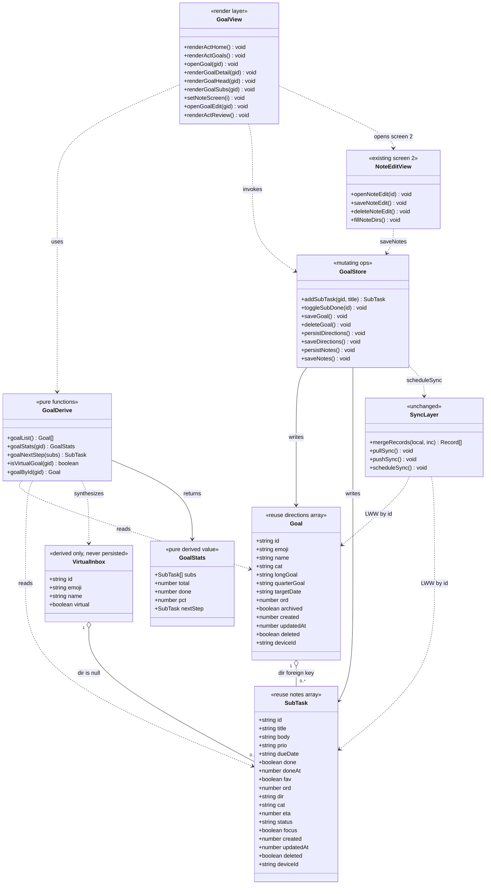
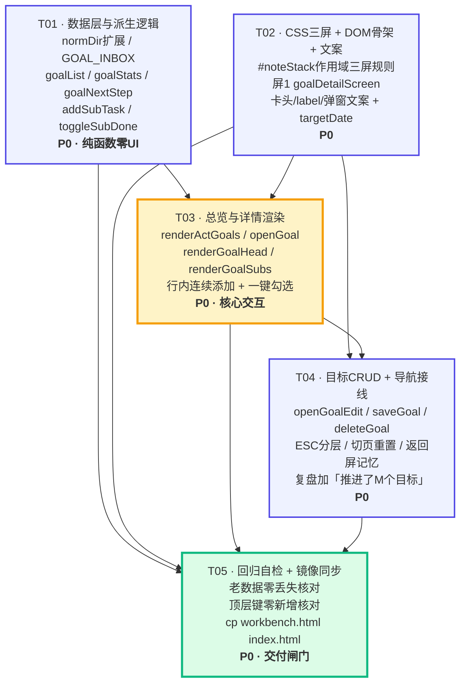

# 系统设计 · 需求 A：待办重做为「大目标 → 子待办」

> 文档类型：系统设计 + 任务分解 ｜ 撰写：架构师 高见远 ｜ 日期：2026-08-07
> 上游输入：`docs/prd-todo-goals.md`（PM 许清楚）
> 需求编号：**A** ｜ 与需求 B（GitHub 语义搜索）**完全独立，可并行开发**
> 主理人已拍板决策：**方案 A1（复用 `directions`，零新增同步键）**、**两级结构**、**虚拟「📥 未归类」**

---

## Part A · 系统设计

### 1. 实现方案（Implementation Approach）

#### 1.1 难点分析

| # | 难点 | 本质 | 对策 |
|---|---|---|---|
| D1 | **不能新增同步顶层键** | 同步 payload 键被 3 处白名单硬编码（`supabase_store.RECORD_KEYS` L36-39 / `server.api_push` L920-957 / `server.api_pull` L900），漏改一处**静默丢数据**，且用户必须重启后端 | **复用 `directions` 作为 Goal、`notes` 作为 Sub-task**，只给已有数组的记录加可选字段。`merge_records` 是**按 `id` 整条 LWW**、无字段级 schema，新字段随记录整体透传 → **后端零改动、用户无需重启** |
| D2 | **`.dj-track` 是硬编码两屏，而 diary 也在用它** | `.dj-track{width:200%}` / `.dj-screen{width:50%}` / `.dj-stack.show-edit .dj-track{translateX(-50%)}`（L176-179）被 `#noteStack`（行动系统）与 `#djStack`（日记）**共用**。直接改全局规则会把日记页面撑坏 | **用 ID 作用域覆盖**：只写 `#noteStack .dj-track{width:300%}` 等规则（特异性 (1,1,0) > (0,1,0)），`#djStack` 完全不受影响。**零新增 CSS 框架、零影响其他模块** |
| D3 | **行内连续添加时"焦点不能丢"** | 若回车后整屏重渲染（含输入框），`innerHTML` 重建 DOM → 输入框被替换 → 焦点丢失，用户无法连续敲。这是 US2/G2 的成败点 | **输入框放在 `#goalSubList` 之外**，回车只重渲染 `#goalSubList` + 进度条两个容器，**绝不重建输入框**。另加 `input.focus()` 兜底 |
| D4 | **中文输入法回车误触发** | 拼音候选框按回车选词时，`keydown` 的 `key==="Enter"` 同样触发 → 会把半截拼音创建成待办 | 判定 `e.isComposing \|\| e.keyCode===229` 直接 return（**必须写，否则中文用户 100% 踩**） |
| D5 | **`dir===null` 散装任务无处安放** | 强制先建目标破坏"想到就记"；真建一条「未归类」目标又要写数组、参与同步、可被误删 | **虚拟目标**：`id='__inbox__'`，渲染期计算、**永不写入 `directions`、永不参与同步**。三处硬闸门（`saveGoal`/`deleteGoal`/`openGoalEdit`）拦截，保证零污染、可回滚 |
| D6 | **`openDir` 一函数双职责** | 现有 `openDir(id)`（L2500）既是"看该方向下的任务"又是"编辑方向元信息"，无法承载新的"进入详情屏" | **拆成两个**：`openGoal(id)` = 进屏1看子待办；`openGoalEdit(id)` = 弹窗改元信息。旧 `openDir` 全部调用点改写 |
| D7 | **老数据零丢失** | 用户已有 4 条默认方向 + 大量历史任务 | **零迁移脚本、零字段删除、零键重命名**。`normDir` 只做"补默认值"（幂等）。最坏回滚 = 换回旧 `workbench.html`，数据完全无损 |

#### 1.2 框架选型

| 层 | 选型 | 理由 |
|---|---|---|
| 前端 | **原生 HTML/CSS/JS 单文件 `workbench.html`** | 沿用现状。PRD §1 明确**禁止**引入 Vite/React/构建工具。本需求纯前端，无新增依赖 |
| 状态管理 | **模块级可变数组 + `LS.set` 持久化 + `scheduleSync()` 防抖推送** | 沿用 `notes`/`directions`/`reviews` 现有模式，零学习成本 |
| 路由/转场 | **`.dj-stack / .dj-track` 三屏（ID 作用域扩展）** | 复用现有 CSS 转场机制。参照 `.idea-track`（3 屏 `show-1/show-2`）与 `.cog-track`（N 屏 `--cog-n`）的成熟先例 |
| 数据同步 | **`mergeRecords` 记录级 LWW（不动）** | 后端零改动是本设计的核心收益 |
| 后端 | **不改** `server.py` / `supabase_store.py` | 见 D1 |

#### 1.3 架构模式

**MV-Render 模式**（项目既有惯例，非 MVC/MVVM）：

```
数据层（可变数组）  →  派生层（纯函数，不落库）  →  渲染层（innerHTML + 事件重绑）
notes / directions      goalList / goalStats        renderActGoals / renderGoalSubs
       ↑                    goalNextStep                      ↓
       └────────────  写操作（addSubTask / toggleSubDone / saveGoal）  ←──── 用户交互
                              ↓
                    persistXxx() + scheduleSync()
```

**关键约束**：派生层（`goalStats` / `goalList`）**必须是纯函数、零副作用、零持久化**。虚拟「📥 未归类」只存在于派生层输出中。

---

### 2. 文件列表（File List）

| 相对路径 | 动作 | 说明 |
|---|---|---|
| `workbench.html` | **修改（唯一真相）** | 全部改动集中于此。见 §2.1 分区明细 |
| `index.html` | **覆盖同步** | `cp workbench.html index.html`，**字节级一致**（MEMORY 铁律） |
| `server.py` | **不改** | 方案 A1 的核心收益 |
| `supabase_store.py` | **不改** | 同上 |
| `.env` / `.env.example` | **不改** | 无新增配置 |
| `docs/design-todo-goals.md` | 新建 | 本文档 |

#### 2.1 `workbench.html` 改动分区（按行号定位，行号为改动前基线）

| 区块 | 基线行号 | 动作 |
|---|---|---|
| CSS · dj 三屏作用域 | L176-197 之后追加 | 新增 `#noteStack` 作用域三屏规则 + 屏1 隐藏 FAB |
| CSS · 行动系统样式 | L199-248 区内追加 | 新增 `.goal-*` 系列（进度条 / 行内添加 / 子待办行 / 虚拟卡 / 已完成折叠） |
| DOM · 卡头文案 | L974 | 「🧭 人生方向 / ＋ 新方向」→「🎯 我的目标 / ＋ 新目标」，`#actNewDir` → `#actNewGoal` |
| DOM · 新增屏 1 | L990 与 L991 之间 | 插入 `<div class="dj-screen" id="goalDetailScreen">…` |
| DOM · 编辑页 label | L1005 | 「人生方向」→「所属目标」（`#noteEDir` 本身不动） |
| DOM · 目标弹窗 | L1058-1080 | 标题/label 文案改；新增 `#goalTargetDate`；**移除** `#dirTasks` 块（L1073-1074，被屏1 取代） |
| JS · 数据层 | L1605-1619 | `normDir` 补 `targetDate/ord/archived`；新增 `GOAL_INBOX` 常量 |
| JS · 派生层 | L2347 附近新增 | `goalList()` / `goalStats()` / `goalNextStep()` / `isVirtualGoal()` |
| JS · 首页渲染 | L2390-2407 | `renderActDirs` → **`renderActGoals`**（进度条 + 下一步 + 虚拟卡） |
| JS · 屏 1 渲染 | L2407 之后新增 | `setNoteScreen` / `openGoal` / `renderGoalDetail` / `renderGoalHead` / `renderGoalSubs` |
| JS · 写操作 | L2407 之后新增 | `addSubTask()` / `toggleSubDone()` |
| JS · 复盘 | L2420-2437 | `renderActReview` 增「推进了 M 个目标」一行 |
| JS · 编辑页 | L2443-2462, L2483-2488 | `openNoteEdit` 记忆来源屏；保存/删除后返回来源屏 |
| JS · 目标增删改 | L2498-2528 | `openDir/saveDir/deleteDir` → `openGoalEdit/saveGoal/deleteGoal` |
| JS · 事件绑定 | L2572-2595 | `#actNewGoal` / `#goalBack` / `#goalEditBtn` / `#goalAddInput` 等 |
| JS · 导航重置 | L1563 | `$("#noteStack").classList.remove("show-edit")` → `setNoteScreen(0)` |
| JS · ESC 分层返回 | L2023 | 屏2 → 屏1/屏0；屏1 → 屏0 |
| JS · 导出/同步 | L4873, L4947, L4960 | **不改**（`directions` 已在列） |

---

### 3. 数据结构与接口（Data Structures and Interfaces）



#### 3.1 新增/变更字段规格

| 数组 | 字段 | 类型 | 默认 | 优先级 | 说明 |
|---|---|---|---|---|---|
| `directions` | `targetDate` | `string \| null` | `null` | P1 | 目标截止日 `YYYY-MM-DD` |
| `directions` | `ord` | `number` | `0` | P1 | 手动排序权重（升序） |
| `directions` | `archived` | `boolean` | `false` | P2 | 归档 |
| `notes` | — | — | — | — | **零字段变更**，`dir` 即父目标 id |

`normDir` 升级（**必须幂等**，老数据反复跑不变形）：

```js
function normDir(d){
  d = d || {};
  d.deleted      = !!d.deleted;
  d.cat          = d.cat || "个人";
  d.longGoal     = d.longGoal || "";
  d.quarterGoal  = d.quarterGoal || "";
  d.targetDate   = d.targetDate || null;     // 新增
  d.ord          = Number.isFinite(d.ord) ? d.ord : 0;   // 新增
  d.archived     = !!d.archived;             // 新增
  return d;
}
```

#### 3.2 虚拟「📥 未归类」契约（硬约束）

```js
const GOAL_INBOX = { id:"__inbox__", emoji:"📥", name:"未归类", cat:"个人",
                     longGoal:"", quarterGoal:"", targetDate:null, virtual:true };
function isVirtualGoal(gid){ return gid === GOAL_INBOX.id; }
```

| 场景 | 必须行为 | 闸门位置 |
|---|---|---|
| `goalList()` | 仅当存在 `!deleted && !dir` 的 note 时，把 `GOAL_INBOX` **追加到数组末尾** | `goalList()` |
| `openGoalEdit('__inbox__')` | **直接 return + toast「未归类不是真实目标，不能编辑」** | `openGoalEdit()` 首行 |
| `saveGoal()` | 若 `editingGoalId==='__inbox__'` → return | `saveGoal()` 首行 |
| `deleteGoal()` | 同上 → return | `deleteGoal()` 首行 |
| `addSubTask('__inbox__', t)` | 创建 note 时 **`dir = null`**（不是 `'__inbox__'`） | `addSubTask()` 内映射 |
| 屏 1 头部 | 隐藏 ✏️ 编辑按钮；显示提示「这些是没有归属目标的待办，可逐条移动到目标里」 | `renderGoalHead()` |
| `directions` 数组 | **任何时刻都不得包含 `id==='__inbox__'` 的记录** | 交付自检项 |

#### 3.3 派生函数签名与语义

```js
/** 返回渲染用目标列表：真实目标（未软删、未归档，按 ord→created 升序）+ 可选虚拟未归类 */
function goalList(){ … }              // => Goal[]

/** 纯派生统计。gid==='__inbox__' 时统计 dir 为空的任务 */
function goalStats(gid){
  const subs = notes.filter(n => !n.deleted &&
                 (isVirtualGoal(gid) ? !n.dir : n.dir === gid));
  const done = subs.filter(n => n.status === "done").length;
  return { subs, total: subs.length, done,
           pct: subs.length ? Math.round(done * 100 / subs.length) : 0,
           nextStep: goalNextStep(subs) };
}

/** 未完成中优先级最高、其次截止日最近的一条 */
function goalNextStep(subs){
  const und = subs.filter(n => n.status !== "done");
  und.sort((a,b) => (PRIO_RANK[a.prio]??1) - (PRIO_RANK[b.prio]??1)
                 || (a.dueDate||"~").localeCompare(b.dueDate||"~"));
  return und[0] || null;
}
```

**进度口径（Q6 已拍板）**：分母 = 该目标下**全部未软删**子待办；分子 = `status==='done'`。`doing` 计入分母、不计分子。`total===0` 时不渲染进度条，改显示「还没有子待办，在下面加第一条吧」。

#### 3.4 三屏导航状态机

| 屏 | index | `#noteStack` class | transform | FAB |
|---|---|---|---|---|
| 目标总览 | 0 | （无） | `0` | 显示（＝新建任务，**行为不变**） |
| 目标详情 | 1 | `show-goal` | `translateX(-33.3333%)` | 隐藏（行内输入框取代） |
| 子待办编辑 | 2 | `show-edit` | `translateX(-66.6667%)` | 隐藏（沿用既有 L197 规则） |

```js
let noteScreen = 0, curGoalId = null, noteEditReturn = 0;
function setNoteScreen(i){
  const s = $("#noteStack");
  s.classList.toggle("show-goal", i === 1);
  s.classList.toggle("show-edit", i === 2);
  noteScreen = i;
}
```

> **为什么屏 2 仍叫 `show-edit`**：L197（`.dj-stack.show-edit .fab{display:none}`）、L2023（ESC）、L1563（切页重置）三处既有代码依赖这个类名。保留即"零改动复用"，改名反而制造三处回归风险。

CSS（**必须 ID 作用域，不得改全局 `.dj-track`**）：

```css
/* 行动系统：三屏（仅作用于 #noteStack，日记 #djStack 不受影响） */
#noteStack .dj-track{ width:300%; }
#noteStack .dj-screen{ width:33.3333%; flex:0 0 33.3333%; }
#noteStack.show-goal .dj-track{ transform:translateX(-33.3333%); }
#noteStack.show-edit .dj-track{ transform:translateX(-66.6667%); }
#noteStack.show-goal .fab{ display:none; }
```

特异性核算：`#noteStack .dj-track` = (1,1,0) > `.dj-track` = (0,1,0) ✅；`#noteStack.show-edit .dj-track` = (1,2,0) > `.dj-stack.show-edit .dj-track` = (0,3,0)？
**注意**：ID 权重高于任意数量的 class，(1,2,0) 恒胜 (0,3,0) ✅。

#### 3.5 行内连续添加（A-02，本需求成败点）

DOM 结构约束——**输入框与列表必须是兄弟节点，不得嵌套**：

```html
<div class="goal-add">
  <span class="goal-add-plus">＋</span>
  <input id="goalAddInput" placeholder="添加子待办，回车即可连续添加" autocomplete="off">
</div>
<div id="goalSubList"></div>     <!-- 只重渲染这里 -->
<div id="goalDoneWrap"></div>    <!-- 与已完成折叠 -->
```

```js
$("#goalAddInput").addEventListener("keydown", e => {
  if(e.key !== "Enter") return;
  if(e.isComposing || e.keyCode === 229) return;   // ⚠️ 中文输入法组合中，禁止提交
  const v = e.target.value.trim();
  if(!v) return;
  addSubTask(curGoalId, v);
  e.target.value = "";
  renderGoalSubs(curGoalId);        // ✅ 只重建 #goalSubList / #goalDoneWrap
  renderGoalHead(curGoalId);        // ✅ 只重建 #goalHeadCard（进度）
  e.target.focus();                 // ✅ 兜底，保证焦点不丢
});
```

**红线**：`renderGoalSubs` / `renderGoalHead` **不得**触碰 `.goal-add` 或 `#goalAddInput`；**不得**在此路径调用 `renderActHome()`（它会重渲染整个屏 0，虽不含输入框但属无谓开销，且易被后续维护者顺手扩大范围）。

```js
function addSubTask(gid, title){
  title = (title||"").trim(); if(!title) return null;
  const dir  = isVirtualGoal(gid) ? null : (gid || null);
  const goal = dir ? directions.find(d => d.id === dir) : null;
  const n = normNote({
    id: uid(), title, body:"", prio:"mid", dueDate:null,
    done:false, doneAt:null, fav:false,
    ord: notes.filter(x => !x.deleted).length,
    created: Date.now(), updatedAt: Date.now(), deleted:false, deviceId,
    dir, cat: goal ? goal.cat : "个人", eta:null, status:"todo", focus:false
  });
  notes.push(n); saveNotes();   // persistNotes + scheduleSync
  return n;
}
```
> 默认值依据 PRD Q8：`prio:'mid'`、`status:'todo'`、`cat` 继承所属目标。

#### 3.6 一键勾选（A-03）

```js
function toggleSubDone(id){
  const n = notes.find(x => x.id === id); if(!n) return;
  const to = n.status === "done" ? "todo" : "done";
  n.status = to;
  n.done   = (to === "done");
  n.doneAt = (to === "done") ? Date.now() : null;
  n.updatedAt = Date.now();
  saveNotes();
  renderGoalSubs(curGoalId); renderGoalHead(curGoalId);
}
```
绑定时**必须** `e.stopPropagation()`，否则冒泡到行容器会同时打开编辑屏：

```js
$$("#goalSubList .sub-chk").forEach(b => b.onclick = e => {
  e.stopPropagation(); e.preventDefault();
  toggleSubDone(b.dataset.sub);
});
```

#### 3.7 目标增删改（由 `openDir/saveDir/deleteDir` 改写）

| 旧 | 新 | 变化 |
|---|---|---|
| `openDir(id)` | `openGoalEdit(id)` | 只负责元信息弹窗；**移除** `#dirTasks` 渲染；新增 `targetDate` 读写；虚拟目标闸门 |
| `saveDir()` | `saveGoal()` | 新增 `targetDate` 写入；虚拟目标闸门；保存后 `renderActGoals()` + 若在屏1 则 `renderGoalHead()` |
| `deleteDir()` | `deleteGoal()` | 行为不变（子待办 `dir` 置 null → 自动落入未归类）；**确认弹窗必须明示**「该目标下的子待办会保留在『📥 未归类』中」；删除后 `setNoteScreen(0)` |

删除确认（Q7）：使用 `confirm()`（项目既有轻量方式）或复用 `.modal`，文案必须包含子待办去向。

#### 3.8 每日复盘增强（A-14）

`renderActReview()` 在「今天完成 N」旁增加：

```js
const advGoals = new Set(
  notes.filter(n => !n.deleted && n.status === "done" && n.doneAt
                 && fmtDate(new Date(n.doneAt)) === today && n.dir)
       .map(n => n.dir)
).size;   // 「推进了 M 个目标」
```
> 口径：**今天有子待办完成**的**真实目标**去重计数（`dir` 为空的不计）。

---

### 4. 程序调用流程（Program Call Flow）

```mermaid
sequenceDiagram
    autonumber
    actor U as 用户
    participant V as GoalView 渲染层
    participant D as GoalDerive 派生层
    participant S as GoalStore 写操作
    participant L as localStorage
    participant Y as SyncLayer 同步

    Note over U,Y: === 场景 0：启动与老数据兼容（零迁移） ===
    U->>V: 打开工作台 / 切到「行动系统」
    V->>D: normNote(notes) + normDir(directions)
    D-->>V: 补齐 targetDate/ord/archived（幂等，不写库）
    V->>V: setNoteScreen(0) + renderActHome()
    V->>D: goalList()
    D->>D: 真实目标(未删未归档, ord→created 升序)
    D->>D: 若存在 dir 为空的 note 则追加 GOAL_INBOX
    D-->>V: Goal[] 含虚拟未归类
    loop 每个目标
        V->>D: goalStats(gid)
        D-->>V: {total, done, pct, nextStep}
    end
    V-->>U: 目标卡列表（进度条 x/y + 下一步）

    Note over U,Y: === 场景 1：进入目标详情（A-05 双层导航） ===
    U->>V: 点击目标卡
    V->>V: curGoalId = gid
    V->>V: setNoteScreen(1)  屏0→屏1 转场 .28s
    V->>D: goalStats(gid)
    D-->>V: stats
    V->>V: renderGoalHead(gid) 写 #goalHeadCard
    V->>V: renderGoalSubs(gid) 写 #goalSubList + #goalDoneWrap
    V-->>U: 目标头(进度) + 常驻输入框 + 子待办列表

    Note over U,Y: === 场景 2：连续添加子待办（A-02 核心） ===
    loop 用户连敲 N 条
        U->>V: 在 #goalAddInput 输入文字 + 回车
        V->>V: 拦截 isComposing / keyCode 229（中文输入法保护）
        V->>S: addSubTask(curGoalId, title)
        S->>S: dir = 虚拟目标 ? null : gid
        S->>S: cat 继承目标; prio=mid; status=todo
        S->>S: notes.push(normNote(...))
        S->>L: persistNotes() 写 wb_notes
        S->>Y: scheduleSync() 800ms 防抖
        S-->>V: 新 SubTask
        V->>V: input.value = "" 并 input.focus()
        V->>V: renderGoalSubs + renderGoalHead（不触碰输入框）
        V-->>U: 新行淡入 + 进度分母 +1，焦点仍在输入框
    end
    Y->>Y: 800ms 静默后 pushSync()（notes/directions 走既有键）

    Note over U,Y: === 场景 3：一键勾选完成（A-03） ===
    U->>V: 点击子待办行左侧勾选框
    V->>V: e.stopPropagation() 阻止打开编辑屏
    V->>S: toggleSubDone(id)
    S->>S: status todo<->done, done, doneAt, updatedAt
    S->>L: persistNotes()
    S->>Y: scheduleSync()
    V->>D: goalStats(curGoalId)
    D-->>V: 新 pct
    V->>V: renderGoalSubs + renderGoalHead
    V-->>U: 行置灰删除线 + 进度条即时前进

    Note over U,Y: === 场景 4：目标 CRUD（A-01） ===
    U->>V: 点「＋ 新目标」/ 详情页 ✏️
    V->>V: openGoalEdit(gid)
    alt gid 是 __inbox__
        V-->>U: toast「未归类不是真实目标」并 return
    else 真实目标或新建
        V-->>U: #dirModal 弹窗（emoji/名称/分类/长期/季度/截止日）
        U->>V: 点保存
        V->>S: saveGoal()
        S->>S: 新建 push / 编辑 Object.assign + updatedAt
        S->>L: persistDirections()
        S->>Y: scheduleSync()
        V->>V: renderActGoals() + 若在屏1 renderGoalHead()
    end

    Note over U,Y: === 场景 5：删除目标（Q7 子待办保留） ===
    U->>V: 弹窗内点「🗑 删除」
    V-->>U: 确认框「子待办会保留在 未归类 中」
    U->>V: 确认
    V->>S: deleteGoal()
    S->>S: 该目标下 notes.dir = null（软保留）
    S->>S: directions 该条 deleted = true
    S->>L: persistNotes() + persistDirections()
    S->>Y: scheduleSync()
    V->>V: setNoteScreen(0) + renderActHome()
    V-->>U: 总览多出「📥 未归类」虚拟卡

    Note over U,Y: === 场景 6：进编辑屏与分层返回 ===
    U->>V: 点子待办标题区
    V->>V: noteEditReturn = noteScreen (=1)
    V->>V: openNoteEdit(id) + setNoteScreen(2)
    U->>V: 保存 / 删除 / ‹返回 / ESC
    V->>S: saveNoteEdit() → saveNotes()
    V->>V: setNoteScreen(noteEditReturn)
    V->>V: 若返回屏1 则 renderGoalSubs+renderGoalHead 否则 renderActHome
    V-->>U: 回到来源屏（不再一路弹回首页）

    Note over U,Y: === 场景 7：跨端同步（后端零改动） ===
    Y->>Y: pullSync() 拉云端 payload
    Y->>Y: mergeRecords(notes, payload.notes) 按 id LWW
    Y->>Y: mergeRecords(directions, payload.directions) 按 id LWW
    Note right of Y: 新字段 targetDate/ord/archived 随整条记录透传<br/>server.py 无需识别、无需重启
    Y->>V: refreshAll() → renderNotes() → renderActHome()
    V-->>U: 另一端加的子待办出现，进度同步更新
```

---

### 5. 待明确事项（Anything UNCLEAR）

| # | 事项 | 架构决策 / 假设 | 风险 |
|---|---|---|---|
| U1 | **FAB 是否上下文化**（PRD §6.2 要求屏0=新建目标） | **本设计偏离 PRD，取更稳方案**：屏 0 FAB **保持现状=新建任务**（`openNoteEdit(null)`，零改动）；新建目标走卡头 `＋ 新目标` 按钮；屏 1/2 隐藏 FAB。理由：① 改 FAB 语义是老用户肌肉记忆的行为回归；② `position:fixed` 元素在 `transform` 祖先下会改变包含块，屏1 自绘 FAB 需额外定位处理，收益不抵风险 | 低。若主理人坚持 PRD 原案，改动点仅 `#noteFab.onclick` 一行 + 屏1 FAB 定位调试，可作 P1 |
| U2 | 「📥 未归类」是否要能改名/加图标 | **不能**。虚拟对象无持久化载体。用户若想管理散装任务，正确路径是新建真实目标后逐条移动 | 无 |
| U3 | `cat`（医学/创业/金融/个人）去留 | **P0 保留不动**（PRD Q4）。仅从总览卡隐藏，编辑弹窗内保留。`dirBadge()` / `fillTaskListFilters()` / `#noteECat` 联动逻辑全部不动 | 无 |
| U4 | 已完成子待办折叠（A-12，PRD 列 P1） | **本设计提到 P0 一并做**。理由：行内连续添加会让列表快速变长，不折叠会立刻把"未完成"淹没，直接损伤 A-02 的体感。实现极轻（一个 `<details>` 或一个 `goalDoneOpen` 布尔） | 无 |
| U5 | 目标排序 `ord` 是否 P0 生效 | **字段 P0 落地（`normDir` 补默认 0）、排序 UI 留 P1**。`goalList()` P0 即按 `ord → created` 排，避免 P1 再改排序函数 | 无 |
| U6 | 删除确认用 `confirm()` 还是自建 modal | **P0 用 `confirm()`**（项目既有做法，零 DOM 成本）。文案必须含「子待办会保留在『📥 未归类』中」 | 低 |
| U7 | 屏 1 是否需要"移动子待办到其他目标"（A-09） | **P1**。P0 通过"点子待办→编辑屏→所属目标下拉"即可完成，路径已通 | 无 |
| U8 | 目标数量上限提示（Q9） | **P2 不做** | 无 |
| U9 | 是否需要为本次改动补 `tests/*.test.mjs` | **建议补**（项目已有 413 例基线）。至少覆盖：`goalStats` 口径、虚拟目标三闸门、`normDir` 幂等、`addSubTask` 的 `dir=null` 映射。**由 QA 阶段决定，不占本设计的 5 个任务额度** | 中。无测试时"虚拟目标被写进 directions"这类回归很难被发现 |

---

## Part B · 任务分解

### 6. 依赖包（Required Packages）

```
（无）
```

| 项 | 说明 |
|---|---|
| 前端第三方库 | **零新增**。不引入 React/Vite/Tailwind/任何 CDN 脚本 |
| Python 包 | **零新增**（本需求不改 `server.py`） |
| 构建步骤 | **无**。`workbench.html` 单文件直出 |
| 唯一"工具" | `cp workbench.html index.html`（系统命令，非依赖） |

---

### 7. 任务列表（按依赖顺序）

#### T01 · 数据层与派生逻辑（纯函数，零 UI）

| 项 | 内容 |
|---|---|
| **Task ID** | T01 |
| **优先级** | **P0** |
| **依赖** | 无 |
| **源文件** | `workbench.html`（L1605-1619 数据层 · L2341-2355 行动系统头部 · L2407 后新增派生区） |

改动点：

| 函数 / 常量 | 动作 | 要点 |
|---|---|---|
| `normDir(d)` L1611 | **改** | 补 `targetDate=null` / `ord=0` / `archived=false`；**必须幂等** |
| `GOAL_INBOX` | **新增** | `{id:"__inbox__", emoji:"📥", name:"未归类", cat:"个人", virtual:true}` |
| `isVirtualGoal(gid)` | **新增** | `gid === "__inbox__"` |
| `goalById(gid)` | **新增** | 虚拟 id 返回 `GOAL_INBOX`，否则查 `directions` |
| `goalList()` | **新增** | 真实目标（`!deleted && !archived`，`ord→created` 升序）+ 条件追加 `GOAL_INBOX` |
| `goalStats(gid)` | **新增** | 见 §3.3；虚拟目标统计 `!n.dir` |
| `goalNextStep(subs)` | **新增** | 未完成中 `PRIO_RANK` 最小、其次 `dueDate` 最近 |
| `addSubTask(gid,title)` | **新增** | 见 §3.5；虚拟目标 → `dir=null`；`cat` 继承目标 |
| `toggleSubDone(id)` | **新增** | 见 §3.6；同步维护 `status/done/doneAt/updatedAt` |

验收：
- [ ] 浏览器 console 手工调用 `goalList()` / `goalStats(id)` 输出正确
- [ ] `directions.map(normDir).map(normDir)` 结果与跑一次完全一致（幂等）
- [ ] `addSubTask('__inbox__','x')` 产生的 note `dir === null`（**不是字符串 `'__inbox__'`**）
- [ ] 全程未修改任何 UI，页面表现与改动前完全一致

---

#### T02 · CSS 三屏扩展 + DOM 骨架 + 全部文案

| 项 | 内容 |
|---|---|
| **Task ID** | T02 |
| **优先级** | **P0** |
| **依赖** | 无（可与 T01 并行） |
| **源文件** | `workbench.html`（CSS L176-248 · DOM L956-1110） |

改动点：

| 位置 | 动作 |
|---|---|
| CSS L197 后 | 追加 §3.4 的 5 条 `#noteStack` 作用域规则。**严禁修改 L177/178/179 全局 `.dj-track/.dj-screen/.dj-stack.show-edit`**（`#djStack` 日记在共用） |
| CSS L248 前 | 追加 `.goal-prog`（4px 细条 / 8px 粗条）、`.goal-add`、`.goal-add-plus`、`.sub-row`、`.sub-chk`、`.sub-row.done`（置灰+删除线）、`.goal-card.virtual`（浅色虚线边框）、`.goal-done-toggle`、`.sub-row.enter`（淡入动画） |
| DOM L974 | `🧭 人生方向` → `🎯 我的目标`；`#actNewDir ＋ 新方向` → `#actNewGoal ＋ 新目标` |
| DOM L975 | `#actDirs` → `#actGoals` |
| DOM L990/L991 之间 | **插入完整屏 1**：`#goalDetailScreen`（topbar `#goalBack`/`#goalDetailName`/`#goalEditBtn` + `#goalHeadCard` + `.goal-add>#goalAddInput` + `#goalSubList` + `#goalDoneWrap`）。注意输入框与列表是**兄弟节点** |
| DOM L1005 | label「人生方向」→「所属目标」（`<select id="noteEDir">` 本身不动） |
| DOM L1060 | `#dirModalTitle` 默认文案「人生方向」→「目标」 |
| DOM L1063 | label「方向名称」→「目标名称」，placeholder「如：医学成长」→「如：3 个月上线工作台 APP」 |
| DOM L1069/1071 | label「长期目标」→「目标说明 / 为什么要做」；「季度目标」→「阶段里程碑」 |
| DOM L1072 后 | **新增**「目标截止日（可选）」+ `<input type="date" id="goalTargetDate">` |
| DOM L1073-1074 | **删除**「当前任务」label + `<div id="dirTasks">`（被屏1 完整取代；全局仅 L2510-2511 引用，随 T04 一并清理） |

验收：
- [ ] 打开「📔 日记」页面，双屏转场**与改动前完全一致**（回归 D2）
- [ ] 手工给 `#noteStack` 加 `show-goal` class，可看到滑到第二屏；加 `show-edit` 滑到第三屏
- [ ] 屏 1 时 FAB 不可见；屏 2 时 FAB 不可见；屏 0 时 FAB 可见
- [ ] `grep -c 'id="dirTasks"' workbench.html` === 0

---

#### T03 · 目标总览与详情渲染（核心交互）

| 项 | 内容 |
|---|---|
| **Task ID** | T03 |
| **优先级** | **P0** |
| **依赖** | **T01, T02** |
| **源文件** | `workbench.html`（L2356-2362 hub · L2390-2407 · L2407 后新增） |

改动点：

| 函数 | 动作 | 要点 |
|---|---|---|
| `renderActHome()` L2358 | **改** | `renderActDirs()` → `renderActGoals()` |
| `renderActDirs()` L2390 | **改名+重写 → `renderActGoals()`** | 遍历 `goalList()`；每卡 = emoji + 名称 + 进度条 + `x/y · NN%` + 「下一步：…」；`total===0` 时不画进度条、显示「还没有子待办」；虚拟卡加 `.virtual` 虚线样式；卡片 `onclick → openGoal(id)`（**不再是 `openDir`**） |
| `setNoteScreen(i)` | **新增** | §3.4 |
| `openGoal(gid)` | **新增** | `curGoalId=gid` → `setNoteScreen(1)` → `renderGoalHead` + `renderGoalSubs` → `setTimeout(()=>$("#goalAddInput").focus(), 300)`（转场结束后再聚焦） |
| `renderGoalHead(gid)` | **新增** | 只写 `#goalDetailName` / `#goalHeadCard`。虚拟目标：隐藏 ✏️、显示引导提示；真实目标：显示 `targetDate` 剩余天数（P1，可先留空） |
| `renderGoalSubs(gid)` | **新增** | 只写 `#goalSubList` + `#goalDoneWrap`。未完成按 `PRIO_RANK → dueDate` 排序；已完成收进 `#goalDoneWrap` 折叠区（默认收起，标题「已完成 N 项 ▾」）。每行 = `.sub-chk` 勾选框 + 标题 + `dirBadge`/`prio-chip2` + `☆`（今日聚焦，A-13） |
| 行内添加绑定 | **新增** | §3.5 完整实现（含 `isComposing` 保护 + 焦点保持） |
| 勾选绑定 | **新增** | §3.6（含 `stopPropagation`） |
| `☆` 绑定 | **新增** | 复用 `renderActFocus` 里的 focus 切换逻辑 |

验收：
- [ ] 首页目标卡显示进度条与 `3/10 · 30%`；`0` 子待办时显示「还没有子待办」而非 `0%`
- [ ] 点目标卡 ≤1 次点击进入详情（首页→详情共 2 次点击内，满足 G1）
- [ ] **连敲 5 条子待办：全程零弹窗、零转场、输入框焦点不丢**（G2 硬门槛）
- [ ] 中文输入法下打「买菜」按回车选词，**不会**产生半截拼音待办
- [ ] 点勾选框只切完成态、**不**打开编辑屏；进度条即时前进
- [ ] 「📥 未归类」卡仅在存在 `dir` 为空的未删任务时出现，带虚线边框

---

#### T04 · 目标 CRUD + 导航接线 + 复盘增强

| 项 | 内容 |
|---|---|
| **Task ID** | T04 |
| **优先级** | **P0** |
| **依赖** | **T02, T03** |
| **源文件** | `workbench.html`（L1563 · L2023 · L2348-2354 · L2420-2437 · L2443-2489 · L2498-2528 · L2572-2595） |

改动点：

| 位置 / 函数 | 动作 | 要点 |
|---|---|---|
| `openDir(id)` L2500 | **改名 → `openGoalEdit(id)`** | 首行加虚拟目标闸门；`#dirModalTitle` 文案「目标 / 新建目标」；读写 `#goalTargetDate`；**删除 `#dirTasks` 相关 6 行（L2509-2511）** |
| `saveDir()` L2515 | **改名 → `saveGoal()`** | 加虚拟闸门；写 `targetDate`；保存后 `renderActGoals()`，且若 `noteScreen===1 && curGoalId===editingGoalId` 则 `renderGoalHead()` |
| `deleteDir()` L2523 | **改名 → `deleteGoal()`** | 加虚拟闸门；加 `confirm()` 且文案含「子待办会保留在『📥 未归类』中」；删除后 `setNoteScreen(0)` + `renderActHome()` |
| `editingDirId` L2499 | **改名 → `editingGoalId`** | 全局 3 处引用同步改 |
| `fillNoteDirs()` L2348 | **改** | 首项文案「— 不关联 —」→「— 未归类 —」（**value 仍为空字符串，`dir` 仍存 `null`**，不得写 `'__inbox__'`） |
| `fillTaskListFilters()` L2352 | **改** | 「全部方向」→「全部目标」 |
| `openNoteEdit(id)` L2443 | **改** | 函数首行 `noteEditReturn = noteScreen;`；末行 `$("#noteStack").classList.add("show-edit")` → `setNoteScreen(2)` |
| `saveNoteEdit()` L2483 | **改** | 结尾改为：`setNoteScreen(noteEditReturn)`；若返回屏1 则 `renderGoalHead+renderGoalSubs`，否则 `renderActHome()` |
| `deleteNoteEdit()` L2485-2488 | **改** | 同上 |
| `renderActReview()` L2420 | **改** | `review-grid` 增第三格「推进了 M 个目标」（口径见 §3.8） |
| 事件绑定 L2582 | **改** | `$("#actNewDir")` → `$("#actNewGoal").onclick = () => openGoalEdit(null)` |
| 事件绑定 L2584-2586 | **改** | `#dirSave→saveGoal` / `#dirDelete→deleteGoal` |
| 事件绑定新增 | **新增** | `#goalBack.onclick = () => { setNoteScreen(0); renderActHome(); }`；`#goalEditBtn.onclick = () => openGoalEdit(curGoalId)` |
| 切页重置 L1563 | **改** | `$("#noteStack").classList.remove("show-edit")` → `setNoteScreen(0)` |
| ESC 分层 L2023 | **改** | 屏2 → `setNoteScreen(noteEditReturn)`；屏1 → `setNoteScreen(0)`；否则沿用原逻辑 |

验收：
- [ ] 新建/编辑/删除目标全通；删除确认框明确告知子待办去向
- [ ] 删除目标后，其子待办出现在「📥 未归类」，**一条不少**
- [ ] 从屏1 点子待办 → 编辑 → 保存，**回到屏1**（不是弹回首页）
- [ ] ESC 在屏2 回屏1、在屏1 回屏0
- [ ] 侧边栏切走再切回「行动系统」，稳定停在屏 0
- [ ] `grep -n 'openDir\|saveDir\|deleteDir\|editingDirId\|actNewDir\|actDirs\|dirTasks' workbench.html` **无残留**
- [ ] 复盘卡显示「推进了 M 个目标」

---

#### T05 · 回归自检 + 镜像同步 + 交付说明

| 项 | 内容 |
|---|---|
| **Task ID** | T05 |
| **优先级** | **P0** |
| **依赖** | **T01, T02, T03, T04** |
| **源文件** | `workbench.html`（只读校验）· `index.html`（覆盖生成） |

步骤：

1. **JS 语法干跑**：抽出 `<script>` 内容用 `node --check` 校验，杜绝低级语法错。
2. **老数据回归**（最关键，A-06）：
   - 备份现有 `localStorage`（用页面「导出」按钮存一份 JSON）
   - 升级后逐项核对：4 条默认方向仍在且名称/emoji 未变；所有 `dir!==null` 任务挂在原目标下；所有 `dir===null` 任务出现在「📥 未归类」；任务总数一致。
3. **同步回归**（A-07）：
   - `console.log(JSON.stringify(pushSync 的 payload 顶层键))` 与改动前**逐字比对**，确认**未新增任何顶层键**
   - `directions` 数组中 `find(d=>d.id==='__inbox__')` 必须为 `undefined`
   - 导出 JSON 顶层键与改动前一致
4. **镜像同步**：`cp workbench.html index.html`，随后 `cmp workbench.html index.html`（或 `diff -q`）必须无差异。
5. **交付说明**：明确写「**本次未改 `server.py`/`supabase_store.py`，用户无需重启后端**」——这是方案 A1 的核心用户价值，必须显式告知。

验收清单：
- [ ] `node --check` 通过
- [ ] 老数据一条不丢（任务总数、方向数逐一核对）
- [ ] push payload 顶层键集合 = 改动前集合（**零新增**）
- [ ] `directions` 中无 `__inbox__`
- [ ] `cmp workbench.html index.html` 无输出（字节级一致）
- [ ] 无新增第三方依赖、无构建步骤
- [ ] 日记 / 灵感捕捉 / 认知资产 / 时间账本 四模块转场与渲染无回归

---

### 8. 共享知识（Shared Knowledge）

> **以下为工程师实现期必须遵守的横切约束。带 ⚠️ 的是踩过坑的铁律。**

#### 8.1 项目级铁律（跨需求，A/B 共享）

1. ⚠️ **`index.html` 必须与 `workbench.html` 字节级一致**。改完执行 `cp workbench.html index.html` 并 `cmp` 验证。否则复现「改了代码用户看到旧界面」的历史大坑（MEMORY §三个必须牢记的历史大坑 #1）。
2. ⚠️ **需求 A 与需求 B 都在改 `workbench.html` 与 `index.html`**。两条线**不得同时热编辑同一文件**；串行合入，或严格按分区（A 改 L176-248/L956-1110/L1563/L2023/L2341-2595；B 改 L250-256/L914-953/L2597-2736）互不越界。**`/api/config` 与 `index.html` 是两需求的共享面，合并时逐行 review**。
3. ⚠️ **不碰存储后端**。`.env` 末尾的 `STORAGE_BACKEND=sqlite` 临时回退行**保持原样**，不删不改。
4. **不引入任何第三方依赖 / 构建步骤**。前端原生 JS，后端 Python 标准库。
5. **软删而非硬删**：所有删除都是 `deleted:true` + `updatedAt:Date.now()`，绝不 `splice`。
6. **写数据三件套**：任何写操作必须 `updatedAt = Date.now()` → `persistXxx()` → `scheduleSync()`（或封装好的 `saveXxx()`）。漏 `updatedAt` 会导致 LWW 判负、改动被其他端覆盖。

#### 8.2 同步契约（需求 A 的生命线）

| 事实 | 含义 |
|---|---|
| 全部业务数据存在 `sync.payload` **一个 JSON 文档**里，不是独立表 | 顶层键 = payload 内的键名 |
| `merge_records` 是**按 `id` 整条 LWW**（`updatedAt` 大者胜，平局比 `deviceId` 字典序），**无字段级 schema、无字段过滤** | ✅ **给已有数组的记录加新字段 = 安全，零后端改动** |
| 新增**顶层键**要改 3 处白名单（`supabase_store.RECORD_KEYS` L36-39 / `server.api_push` L920-957 / `server.api_pull` L900）+ 前端 3 处（导出 L4873 / 拉取 L4947 / 推送 L4960），且**用户必须重启 `python server.py`** | ❌ **本需求严禁新增顶层键** |
| `settings` 是键级合并，其余是记录级合并 | 本需求不动 `settings` |

**自检命令**（合入前必跑）：
```bash
# 顶层键零新增
grep -n 'const payload = {' workbench.html      # 与改动前 diff 应为空
grep -n 'RECORD_KEYS' supabase_store.py         # 应完全未改
git diff --stat server.py supabase_store.py     # 应无输出
```

#### 8.3 CSS 复用约束

| 类名 | 归属 | 本需求可否改 |
|---|---|---|
| `.dj-stack` / `.dj-track` / `.dj-screen` / `.dj-stack.show-edit` | **共享**（`#noteStack` 行动系统 + `#djStack` 日记） | ❌ **只能用 `#noteStack` 作用域覆盖** |
| `.fab` / `.page:not(.active) .fab` / `.dj-stack.show-edit .fab` | 全局 | ❌ 只能追加 `#noteStack.show-goal .fab{display:none}` |
| `.idea-track` / `.cog-track` | 灵感捕捉 / 认知资产 | ❌ 不碰 |
| `.dir-card` / `.dir-emoji` / `.dir-badge` / `.task-row` / `.prio-chip2` / `.status-dot` | 行动系统私有 | ✅ 可扩展（建议新增 `.goal-*` 而非改 `.dir-*`，减少回归面） |

#### 8.4 命名与状态约定

```
数据键（不变）：wb_notes / wb_directions / wb_reviews / wb_dev
同步键（不变）：notes / directions / reviews
虚拟目标 id  ：'__inbox__'（保留字，任何真实记录不得使用）
屏索引       ：0=目标总览 1=目标详情 2=子待办编辑
屏状态类      ：（无）/ show-goal / show-edit
模块变量      ：noteScreen / curGoalId / noteEditReturn / editingGoalId
进度口径      ：分母=未软删子待办全量；分子=status==='done'
行内添加默认值 ：prio='mid' status='todo' cat=继承目标 其余留空
```

#### 8.5 三个观察轴的定位（避免概念打架，写进代码注释）

| 模块 | 轴 | 数据源 | 本次变更 |
|---|---|---|---|
| 🎯 我的目标 | **结构轴**：这件大事由哪些小事组成 | `directions` + `notes.dir` | **本次重做主体** |
| 🎯 今日聚焦 | **时间轴·当下**：今天做哪几件（可跨目标） | `notes.focus \|\| dueDate===today`，取前 3 | 逻辑**不变**，仅在子待办行加 `☆` 快捷入口 |
| 🌙 每日复盘 | **时间轴·回看**：今天推进了多少 | `reviews` + 今日 `doneAt` + `times` | 逻辑**不变**，仅加一行「推进了 M 个目标」 |

一句话：**目标决定"做什么"，今日聚焦决定"今天做哪几件"，每日复盘回答"今天推进了多少"。三者互不替代。**

#### 8.6 部署提示

> ✅ **本需求不改 `server.py` / `supabase_store.py`，用户无需重启后端。**
> 前端改动经浏览器刷新（server 已带 `no-store` 头）即生效；Cloudflare 侧从 git push 自动重建。

---

### 9. 任务依赖图（Task Dependency Graph）



**并行机会**：T01 与 T02 无相互依赖，可并行（T01 改 JS 数据段、T02 改 CSS+DOM 段，物理不重叠）。T03 是关键路径上的最重任务，建议单独排期。

---

### 10. 交付验收总清单

| # | 验收项 | 对应 PRD |
|---|---|---|
| 1 | 不新增任何同步 payload 顶层键；`server.py`/`supabase_store.py` git diff 为空 | A-07 / §9 |
| 2 | 老数据升级后一条不丢（4 默认方向 + 全部历史任务） | A-06 |
| 3 | 行内连续加 5 条子待办：零弹窗、零转场、焦点全程不丢 | A-02 / G2 |
| 4 | 中文输入法回车选词不产生脏数据 | D4（架构补充） |
| 5 | 勾选后进度 x/y 与进度条即时更新，无需刷新 | A-03 / A-04 |
| 6 | 首页→目标子待办列表 ≤ 2 次点击 | A-05 / G1 |
| 7 | 「📥 未归类」为纯虚拟：`directions` 中查无此 id，导出 JSON 中查无此 id | Q5 / §3.2 |
| 8 | 子待办编辑页字段全保留，仅「人生方向」→「所属目标」文案改 | A-08 |
| 9 | 日记 / 灵感 / 认知资产 / 时间账本 无回归（`.dj-track` 未被全局改动） | D2（架构补充） |
| 10 | `cmp workbench.html index.html` 无差异 | Q10 / §9 |
| 11 | 无新增第三方依赖、无构建步骤 | §1 |
| 12 | 用户**无需重启后端** | §4.1（方案 A1 核心收益） |
