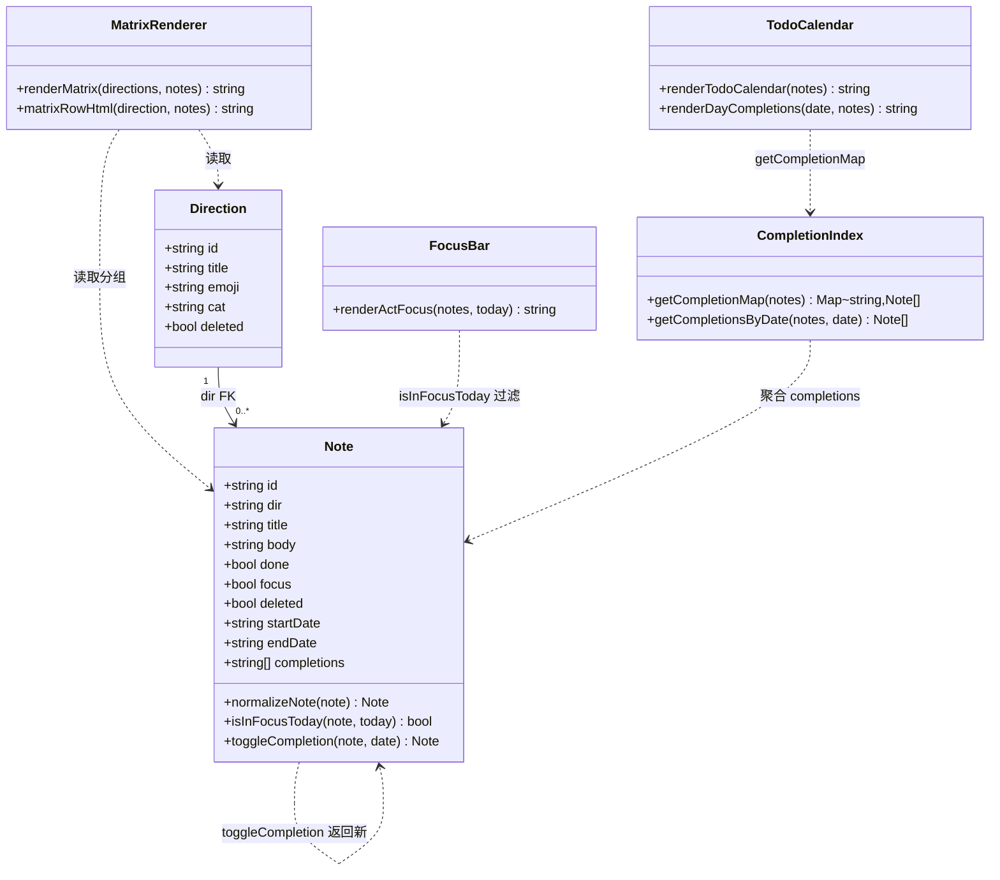
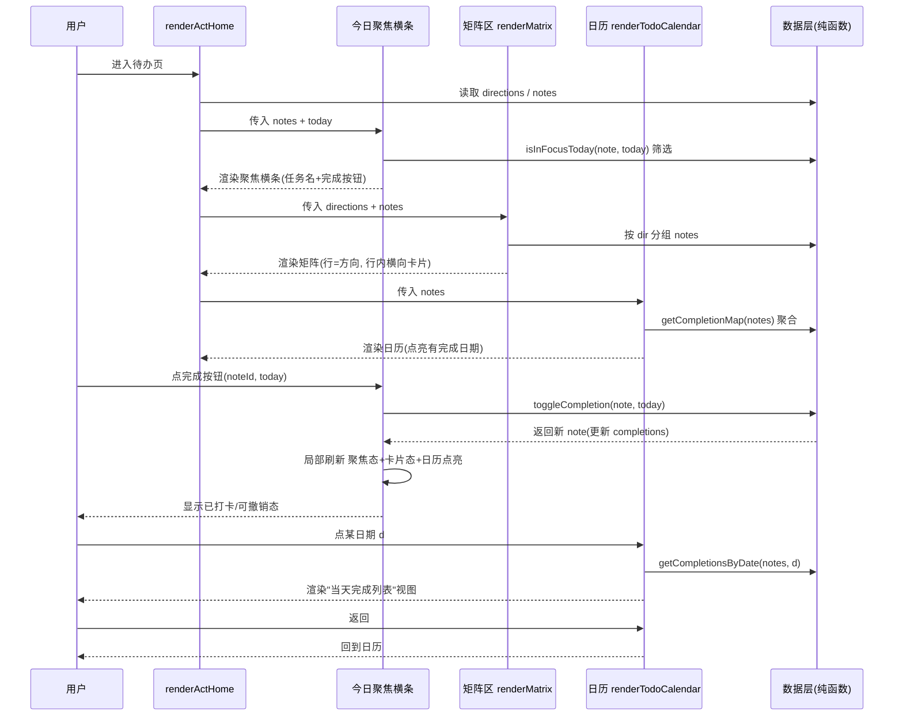
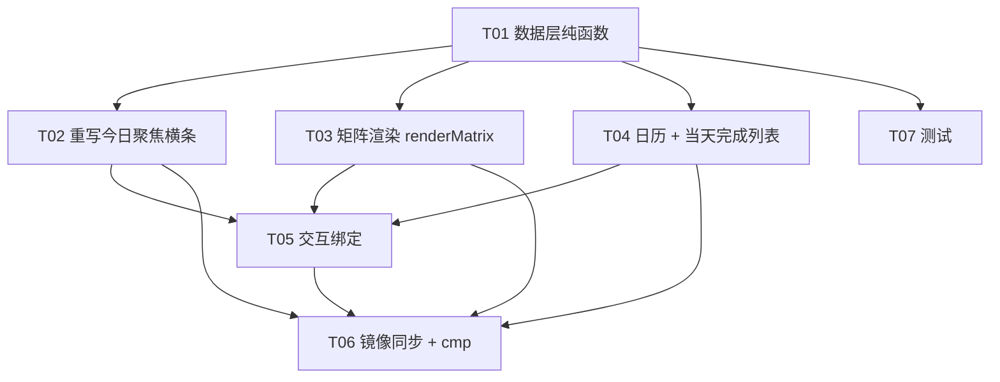

# 系统架构设计 · 待办/行动系统「矩阵式重设计」（时间线驱动 + 每日完成）

> 文档类型：**系统架构设计 + 任务分解**（Architect = 高见远）
> 关联 PRD：`docs/prd-todo-timeline.md`（PM 许清楚，2026-08）
> 关联数据约束：`prd-todo-goals.md` §4（本次沿用）
> 一句话实现方案：**继续用原生 JS 单文件 `workbench.html`（零框架零构建），仅扩展 `notes` 字段（startDate/endDate/completions）并新增纯函数与渲染层，把看板替换为矩阵+日历，镜像 `index.html` 字节一致，后端 `server.py` 完全不动。**

---

## Part A · 系统设计

### 1. 实现方案（Implementation Approach）

#### 1.1 技术难点
| 难点 | 说明 |
|---|---|
| 红线 A · 零后端改动 | 同步 payload 顶层键在 3 处硬编码白名单（`supabase_store.py` `RECORD_KEYS`、`server.py` `api_push` SQLite 分支、`server.py` `api_pull` 空 payload 默认值）。**绝不新增顶层键**，否则需改 3 处 + 重启后端 + 静默丢数据。 |
| 红线 B · 完成记录不丢 | 完成记录必须随 `notes` 记录整体同步（LWW 按 `id` 整条覆盖），不能独立成表。 |
| 兼容旧数据 | 旧 `notes` 无 timeline/completions 字段，首次打开须零转换补齐默认，且 `dir` 外键、`GOAL_INBOX` 虚拟方向语义不变。 |
| 单文件无框架约束 | 保持原生 JS、无构建、不改镜像铁律（`cp` 后 `cmp` 字节一致）。 |

#### 1.2 框架与库选型
- **不引入任何框架/构建工具**（Vite/React/MUI/Tailwind 一律不可用，PRD §1、§8 硬性禁止）。
- 原因：
  1. 这是单文件 `workbench.html`（约 58xx 行原生 JS + localStorage），引入框架会破坏"零构建、单文件可双击打开"的特性，并破坏 `index.html` 镜像字节一致性铁律。
  2. 复用现有海量核心函数（`goalStats`/`addSubTask`/`goalById`/`isVirtualGoal`/`normDir`/`GOAL_INBOX`/`renderActHome` 等），纯函数式扩展成本最低、风险最小。
  3. 新增的 `startDate/endDate/completions` 都是 `notes` 记录上的字段，`merge_records` 会随整条记录透传，无需后端配合。
- **选型结论**：纯原生 HTML/CSS/JS，仅**扩展** `workbench.html` + 同步镜像 `index.html`。

#### 1.3 架构模式
- 维持现有「**数据层（localStorage + 纯函数）→ 渲染层（render* 字符串拼接注入 innerHTML）→ 交互层（bind* 事件委托）**」三段式。
- 本次仅在数据层新增**无副作用纯函数**（便于单测），渲染层把 `renderKanban` 替换为 `renderMatrix` + `renderTodoCalendar`，交互层新增完成/切换/点日绑定。
- 核心复用：`renderActHome()` 仍拆三段，只是中段从看板换成「矩阵 + 日历」。

---

### 2. 文件列表（File List）

| 相对路径 | 类型 | 本次动作 | 说明 |
|---|---|---|---|
| `workbench.html` | 主体（原生 JS 单文件） | **修改** | 扩展数据层、重写聚焦、新增矩阵+日历、绑定交互、note 编辑弹窗加日期 input |
| `index.html` | 同步镜像（字节级一致） | **cp 同步** | `cp workbench.html index.html` 后 `cmp` 校验，零改动逻辑 |
| `tests/todo-timeline.test.mjs` | 测试（新增） | **新增** | 覆盖纯函数与结构渲染，用 Node 内置 `node:test` + `node:assert`，无第三方依赖 |
| `server.py` | 后端（零依赖） | **不动** | 红线：任何后端改动需重启 + 改 3 处白名单，本次规避 |
| `docs/prd-todo-timeline.md` | PRD | 只读 | 输入来源 |
| `docs/design-todo-timeline.md` | 本设计 | 产出 | — |
| `docs/class-diagram.mermaid` | 类图 | 产出 | 数据结构与接口可视化 |
| `docs/sequence-diagram.mermaid` | 时序图 | 产出 | 程序调用流程可视化 |

> 仅 1 个实质代码文件 `workbench.html` + 1 个镜像 + 1 个测试文件。后端零触碰。

---

### 3. 数据结构与接口（Data Structures and Interfaces）

> 完整图见 `docs/class-diagram.mermaid`。以下为要点与 JSON Schema。

#### 3.1 `notes` 单条记录 JSON Schema（扩展后）

```jsonc
{
  "id": "n_xxx",              // 既有
  "dir": "d_xxx" | null,      // 既有外键 -> directions.id；null=未归类(GOAL_INBOX)
  "title": "写 PRD",          // 既有
  "body": "",                 // 既有
  "done": false,              // 既有
  "focus": false,             // 既有：星标（T-11 兜底仍可用，但不再是聚焦唯一来源）
  "deleted": false,           // 既有
  "created": 1690000000000,   // 既有
  "updatedAt": 1690000000000, // 既有
  // —— 本次新增 ——
  "startDate": "2026-08-01" | null, // 时间线起（YYYY-MM-DD），可空=无时间线
  "endDate":   "2026-10-31" | null, // 时间线止（YYYY-MM-DD），可空=无时间线
  "completions": ["2026-08-03", "2026-08-04"] // 已完成日期数组，按「noteId+date」唯一
}
```

- **命名决策**：采用扁平 `startDate` / `endDate`（非嵌套 `timeline:{start,end}`）。理由：扁平字段在 `normalizeNote` 补齐与 `isInFocusToday` 比较时最直接，避免多一层嵌套对象，旧数据补齐成本最低。
- **`completions` 决策**：采用 **B1 嵌套进 notes**（PRD §6.2 推荐），零后端改动。`merge_records` 按 `id` 整条覆盖天然透传；按「noteId+date」天然唯一。

#### 3.2 `directions` 不变
- 字段 `id/title/emoji/cat/deleted` 等不变；`dir` 外键语义不变。
- `GOAL_INBOX`（`id '__inbox__'`）仍是未归类虚拟方向，**不写入 `directions` 数组**。

#### 3.3 数据层纯函数（无副作用，可单测）

```js
// 兼容补齐：旧 notes 无新字段 -> 默认
Note normalizeNote(note) -> note  // 补 startDate=null, endDate=null, completions=[]

// 今日聚焦筛选：时间线覆盖今天
Boolean isInFocusToday(note, today) =
    note.startDate && note.endDate
    && note.startDate <= today && today <= note.endDate
    && !note.deleted

// 完成/撤销：返回新 note（不原地改），completions 去重
Note toggleCompletion(note, date) -> note
    // 若 completions.includes(date) -> 移除（撤销今天这次）
    // 否则 -> push（去重，避免重复）

// 聚合：日期 -> 当天完成的 notes 列表
Map<String, Note[]> getCompletionMap(notes)        // 全部日期
Note[] getCompletionsByDate(notes, date)           // 某日
```

- `today` 取值：`new Date()` 本地格式化 `YYYY-MM-DD`（见 §8 共享知识）。
- `toggleCompletion` 设计为返回新对象（不可变），便于渲染层局部刷新与测试断言。

#### 3.4 渲染层函数（字符串注入）

| 函数 | 替换/新增 | 说明 |
|---|---|---|
| `renderActHome()` | 维持骨架 | 三段：聚焦 → 矩阵+日历 → 每日复盘（复盘不改） |
| `renderActFocus()` | **重写** | 仅列任务名 + 完成按钮，数据源 = `notes.filter(isInFocusToday)` |
| `renderMatrix()` | **新增**（取代 `renderKanban` 调用点） | 行=`direction`，行内横向 `notes` 卡片 |
| `matrixRowHtml(direction, notes)` | 新增 | 单行 HTML |
| `renderTodoCalendar(notes)` | **新增** | 底部月视图日历，聚合 `getCompletionMap` 点亮 |
| `renderDayCompletions(date, notes)` | **新增** | 点日下钻「当天完成列表」视图，可返回 |
| `renderActReview()` | 不变 | 每日复盘（时间账本联动）保持不变 |
| `renderNoteEditor()` / note 编辑弹窗 | **扩展** | 新增两个 `input[type=date]`（startDate/endDate 入口） |
| ~~`renderKanban` / `kanbanColumnHtml` / `addKanbanColumn` / `deleteKanbanColumn` / `bindKanban` / `syncBoardStar`~~ | **删除或标记 @deprecated** | 看板专属，本次移除 |

#### 3.5 类图（Mermaid）



---

### 4. 程序调用流程（Program Call Flow）

> 完整图见 `docs/sequence-diagram.mermaid`。

```
用户 进入待办页
  └─ renderActHome()
       ├─ 读 directions / notes (localStorage)
       ├─ renderActFocus(notes, today)
       │    └─ notes.filter(isInFocusToday) ──► 横条(任务名 + 完成按钮)
       ├─ renderMatrix(directions, notes)
       │    └─ 按 dir 分组 → 每行 direction + 行内横向 notes 卡片(日期显示切换)
       └─ renderTodoCalendar(notes)
            └─ getCompletionMap(notes) 聚合 ──► 点亮有完成日期

交互①：点聚焦「完成」按钮(noteId, today)
  └─ toggleCompletion(note, today) ──► 更新 completions
  └─ 局部刷新：聚焦态 + 卡片态 + 日历点亮

交互②：点日历某日 d
  └─ getCompletionsByDate(notes, d) ──► renderDayCompletions(d) 视图
  └─ 返回 ──► 回到 renderTodoCalendar

交互③：编辑小任务弹窗
  └─ 新增 startDate / endDate 两个 input ──► 保存写回 notes
```

#### 4.1 时序图（Mermaid）



---

### 5. 待明确事项（Anything UNCLEAR）

| # | 待确认点 | 本设计默认建议 |
|---|---|---|
| U1 | **日期编辑 UI 入口**：起止日期 input 放在 note 编辑弹窗正文区还是新增一个"时间线"折叠区？ | 放现有 note 编辑弹窗正文（复用 `renderNoteEditor`），加两个 `input[type=date]`，保持零新增页面。 |
| U2 | **无时间线小任务是否进今日聚焦**（PRD Q2/T-11）：默认不进；兜底靠 `focus` 星标或归入「未归类」行。 | 默认不进聚焦；`dir===null` 或起止为空者归入「📥未归类」行照常显示，但不进聚焦。与 US5 兼容。 |
| U3 | **日历仅月视图是否够**（PRD Q3/T-15）：MVP 只做月视图。 | 首版月视图；周视图留 P2。 |
| U4 | **"每日完成"是否计入每日复盘时间账本**（PRD Q4）：两轴独立。 | 首版不联动，保持模块解耦；后续可加"今日打卡 N 项"。 |

> 以上均不阻塞 P0；PRD 已授权「先做出 MVP 再迭代」。

---

## Part B · 任务分解（Task Decomposition）

### 6. 依赖包列表（Required Packages）
```
无。纯原生 HTML/CSS/JS，测试用 Node 内置 node:test / node:assert，零第三方依赖。
```

---

### 7. 任务列表（有序、含依赖、按实现顺序）

| Task ID | 任务名 | 源文件 | 依赖 | 优先级 |
|---|---|---|---|---|
| **T01** | **数据层：扩展 `normalizeNote` + 新增纯函数** | `workbench.html` | — | P0 |
| **T02** | **UI：重写今日聚焦横条（`renderActFocus`）** | `workbench.html` | T01 | P0 |
| **T03** | **UI：新增矩阵渲染 `renderMatrix`（取代看板）** | `workbench.html` | T01 | P0 |
| **T04** | **UI：底部日历 `renderTodoCalendar` + 当天完成列表 `renderDayCompletions`** | `workbench.html` | T01 | P0 |
| **T05** | **交互绑定：完成按钮 / 日期显示切换 / 日历点日 / note 编辑弹窗加起止日期** | `workbench.html` | T02,T03,T04 | P0 |
| **T06** | **镜像同步：`cp workbench.html index.html` + `cmp` 字节校验** | `workbench.html`,`index.html` | T02–T05 | P0 |
| **T07** | **测试：新增 `tests/todo-timeline.test.mjs`** | `tests/todo-timeline.test.mjs` | T01 | P1 |

#### 各任务内容详述
- **T01 数据层**：在 `workbench.html` 数据层扩展 `normalizeNote` 补 `startDate=null, endDate=null, completions=[]`；新增纯函数 `isInFocusToday(note, today)`、`toggleCompletion(note, date)`（去重/撤销）、`getCompletionMap(notes)`、`getCompletionsByDate(notes, date)`。无副作用、便于单测。
- **T02 今日聚焦横条**：重写 `renderActFocus()`，数据源 = `notes.filter(isInFocusToday)`；每行仅「任务名 + 完成按钮」，不显示截止日/倒数；已打卡态（completions 含 today）置灰/打勾。
- **T03 矩阵渲染**：新增 `renderMatrix()` 替换 `renderKanban` 调用点；`matrixRowHtml(direction, notes)` 行=方向（左固定列宽）、行内横向排 notes 卡片（可横向滚动）；卡片含日期显示切换控件（T-10）；`📥未归类` 行承载 `dir===null`/无时间线任务（U2）。**删除或 @deprecated**：`renderKanban`/`kanbanColumnHtml`/`addKanbanColumn`/`deleteKanbanColumn`/`bindKanban`/`syncBoardStar`。
- **T04 日历 + 当天列表**：新增 `renderTodoCalendar(notes)`（月视图，聚合 `getCompletionMap` 点亮已完成日期）+ `renderDayCompletions(date, notes)`（点日下钻，可返回）。
- **T05 交互绑定**：完成按钮 → `toggleCompletion` + 局部刷新聚焦/卡片/日历；卡片日期显示切换（无截止/剩 N 天）；日历点日 → 当天完成列表；note 编辑弹窗新增 `startDate`/`endDate` 两个 `input[type=date]` 作为日期填写入口。
- **T06 镜像同步**：`cp workbench.html index.html` 后 `cmp` 确认字节一致（镜像铁律）；本任务为交付前最后一步，确保逻辑零改动同步。
- **T07 测试**：`tests/todo-timeline.test.mjs` 用 `node --test` 跑，覆盖 `normalizeNote` 旧数据兼容、`isInFocusToday` 边界（含/不含 today、空值）、`toggleCompletion` 去重与撤销、`getCompletionMap`/`getCompletionsByDate` 聚合、矩阵渲染结构（行=方向、未归类行存在）、日历点亮逻辑。

---

### 8. 共享知识（Shared Knowledge / 跨文件约定）

- **日期格式**：统一 `YYYY-MM-DD` 字符串（本地时区，由 `new Date()` 格式化，注意补零）。
- **日期比较**：同格式字符串可直接用字典序 `<= / >=` 比较大小，无需 `Date` 解析。
- **`today` 取值**：每次渲染取本地 `new Date()` → `YYYY-MM-DD`（建议在 `renderActHome` 入口算一次传入，避免多次渲染日期漂移）。
- **完成记录只存日期不存时间**：`completions` 元素为 `YYYY-MM-DD`，按「noteId+date」唯一。
- **去重**：`completions.includes(date)` 判断，toggle 时移除/新增。
- **软删语义**：所有筛选（聚焦/矩阵/日历）排除 `note.deleted === true`；`directions` 排除 `deleted`。
- **外键与虚拟方向**：`note.dir === null` → `GOAL_INBOX`（`id '__inbox__'`，不入 `directions` 数组）；矩阵末行固定「📥未归类」。
- **同步铁律**：任何数据改动只动 `notes`/`directions` 记录内字段，绝不新增 payload 顶层键（红线 A）；`completions` 必须嵌 `notes`（红线 B）。
- **不可变更新**：`toggleCompletion` 返回新 note 对象，渲染层据此局部刷新，不原地 mutate 以保持可预测。

---

### 9. 任务依赖图（Task Dependency Graph）



---

## 红线提醒（交付前必读）
1. **零后端改动**：不碰 `server.py`、不新增 payload 顶层同步键、不改任何白名单。完成记录必须嵌套进 `notes.completions`。
2. **镜像字节一致**：每次改完 `workbench.html` 必须 `cp` → `index.html` 且 `cmp` 通过。
3. **旧数据零丢失**：`normalizeNote` 补齐默认，不执行迁移脚本、不删除/重命名字段；最坏回滚=换回旧 `workbench.html`，数据无损。
4. **无新依赖、无构建**：纯原生 JS，测试用 Node 内置模块。
