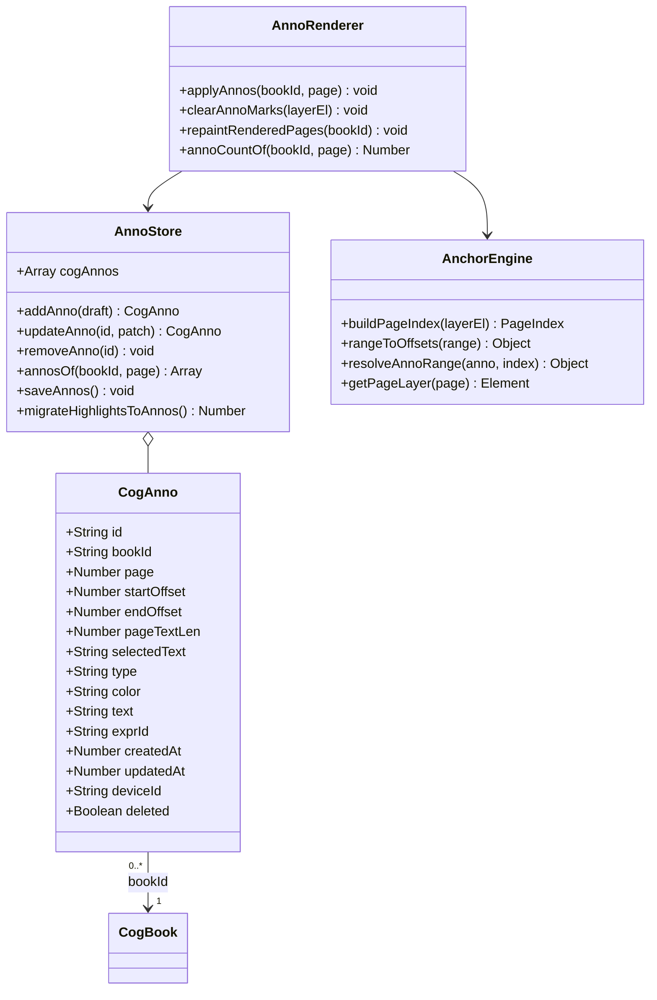
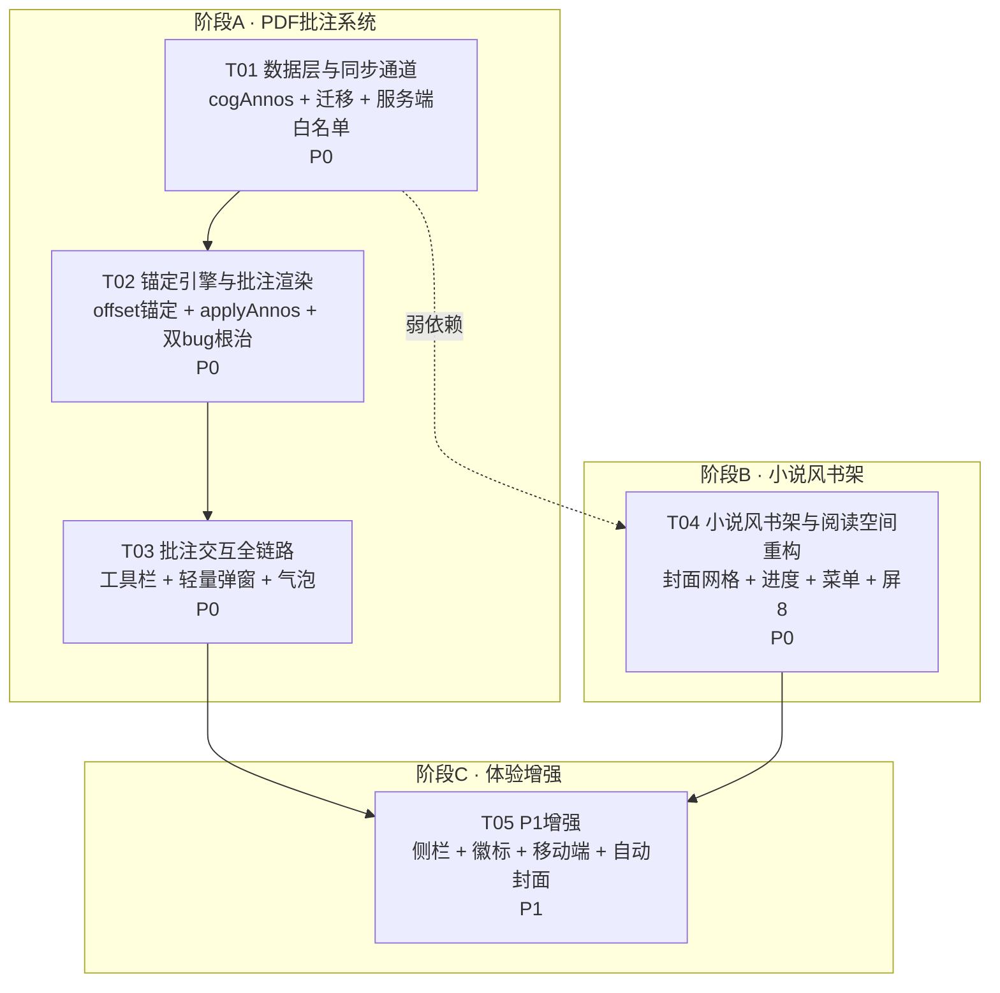

# 系统设计：PDF 批注系统 + 小说风书架

> 目标文件：`workbench.html`（单文件原生 JS，4351 行）
> 架构师：高见远 ｜ 输入：许清楚的 PRD ｜ 原则：最小侵入、不重写阅读器、沿用现有工具函数与 CSS 变量

---

## 0. 代码实读结论（先摆事实，后谈设计）

以下每一条都已在源码中逐行核对，不是推测：

| # | 事实 | 位置 | 影响 |
|---|------|------|------|
| F1 | `index.html` 与 `workbench.html` MD5 完全一致（`927f5c49...`），是 `cp` 副本 | — | 每次改完必须同步 cp |
| F2 | `applyHighlights(pagesEl, bookId, page)` 内部 `pagesEl.querySelector('.textLayer')` 取**第一个** textLayer | L3869-3890 | 只要 scope 传大了就落错页 |
| F3 | 调用点已分别传 `slot`（滚动 L3682）与 `pagesEl`（单页 L3629）、选中处传 `pdfPageDivs[cur]`（L3845）——**多页 bug 表面已绕过，但接口靠调用方自觉，脆弱** | — | 需从接口层根治 |
| F4 | `full.indexOf(r.original)` 只命中首次出现 | L3878 | 同页重复文字必然错位（PRD 指出的 bug ①） |
| F5 | **更深的 bug**：`full` 是 span.textContent 无分隔拼接，而 `r.original` 来自 `sel.toString()`（浏览器会在换行处插入 `\n`/空格）。**多行选中时 indexOf 直接返回 -1，高亮静默丢失** | L3830 vs L3874 | 这是"高亮时有时无"的真凶，PRD 未提及 |
| F6 | `mergeRecords(local, inc)` 是**记录级 LWW**：按 id 归并，`updatedAt` 大者胜，平局比 `deviceId` 字典序 | L1512-1524 | 可直接复用于 cogAnnos ✔ |
| F7 | **`sync.payload` 服务端是白名单**：`supabase_store.py:36 RECORD_KEYS` 与 `server.py:940 new_payload` 都是硬编码键列表 | — | **新增 `cog_annos` 必须改服务端，否则推上去被静默丢弃** |
| F8 | **既存严重 bug**：`cog_expr` 前端在推、服务端两个分支都**没有**这个键 → 英语表达从未跨端同步过，一直在丢 | `supabase_store.py:36`、`server.py:940-953` | 顺手一起修 |
| F9 | `buildTextLayer` 严格按 `textContent.items` 顺序 `appendChild`，DOM 序 == PDF 文本流序 | L3789-3811 | offset 锚定坐标系可建立在 DOM 序上 ✔ |
| F10 | textLayer 的 span 是 `position:absolute; font-size:1px; transform:matrix(...)` | L3801-3806 + CSS L478 | **角标不能用 `span::after`**，会被 matrix 缩放成畸形 |
| F11 | `.cog-track{width:800%}` / `.cog-screen{width:12.5%}` / `show-1..show-7` — **8 个屏位已用满** | CSS L323-339 | 新增"书籍信息"屏必须重算整套百分比 |
| F12 | `.pdf-sel-row` 用 `position:absolute` + `getBoundingClientRect()`（视口坐标） | CSS L484 + L3838 | 坐标系不匹配，window 一滚就错位。改 `fixed` |
| F13 | `renderCogShelf` 卡片是 `.book-cover{height:96px}` 横条 emoji，`.shelf` 为 `auto-fill minmax(140px)` | L2800-2822 + CSS L394-401 | 改 2:3 竖版封面网格 |
| F14 | 点书架卡片 → `openCogReadingSpace(id)` → 屏5 顶部是一整套表单（状态/进度/位置/片段），PDF 在下方 `#crFileBox` | L2821, L3185-3281 | 需把表单剥离到二级页 |
| F15 | `saveBookProgress(b,n)` 已写 `lastPage/lastReadAt`，但**没写 `progress`**；`progress` 仍靠屏5 手动滑杆 | L3894-3899, L3901 | 进度自动化在此处接入 |
| F16 | 阅读器已具备：IndexedDB 缓存、fit-to-width、dpr 上限保护、显存回收、resize 重排、目录、滚动侦测 | L3328-3780 | **能力完备，不要重写，只挂钩子** |
| F17 | 现有高亮存于 `cogReads`，形态 `{kind:"annotation", sourceBookId, page, original, highlight:true, understanding}` | L3861 | 迁移源结构明确 |

---

## Part A：系统设计

### 1. 实现方案与技术选型

#### 1.1 总体判断

**确认沿用原生 JS 单文件方案，零新增依赖。** 理由：

1. 现有 PDF 阅读器（L3328-3780，约 450 行）已经解决了最难的部分——fit-to-width 自适应、dpr 高清渲染与 canvas 面积硬上限、显存预算回收、IndexedDB 秒开缓存、IntersectionObserver 懒渲染、resize 重排保位。这些是踩过坑的资产，**任何框架化重写都是净亏损**。
2. 本次两个功能块（批注 / 书架）都是**在既有渲染管线上挂钩子 + 换视图模板**，不涉及状态管理复杂度上升到需要框架的程度。
3. 单文件部署（Caddy 静态托管 + Cloudflare Pages）是现有交付形态，引入构建链会破坏 `cp workbench.html index.html` 的极简发布流程。

#### 1.2 核心技术难点与解法

**难点 A：批注锚点如何在"重渲染"后精确复原**

textLayer 每次渲染都被完全重建（缩放、resize、切模式、显存回收后重进可视区，都会重建）。锚点必须是**与像素、缩放、DPR 全部无关**的量。

> **解法：以 textLayer 内 span 的 DOM 序 textContent 拼接串作为唯一锚定坐标系。**
>
> ```
> spans = [...layer.children]                    // DOM 序 == PDF 文本流序（F9 已验证）
> full  = spans.map(s => s.textContent).join('') // 无分隔拼接
> starts[i] = 前 i 个 span 的长度前缀和
> ```
>
> - **写入时**：不从 `sel.toString()` 反查，而是直接由 `Range` 算 —— 由 `range.startContainer` 上溯找到宿主 span，`startOffset = starts[i] + range.startOffset`。`selectedText` 用 **`full.slice(start, end)` 切片**得到。
> - **读取时**：遍历 spans，`spanStart < endOffset && spanEnd > startOffset` 即命中。
>
> **这一招同时根治了 F4 和 F5 两个 bug**：写入与读取共用同一坐标系，逐字自洽，既不存在"首匹错位"，也不存在"toString 插了换行导致 indexOf 返回 -1"。

**难点 B：offset 的鲁棒性（跨设备 / 跨 PDF.js 版本文本流漂移）**

offset 是脆弱锚点：若某端 PDF.js 版本不同导致 `textContent.items` 切分不同，offset 会整体漂移。

> **解法：三级降级命中策略（`resolveAnnoRange`）**
>
> | 级别 | 条件 | 动作 |
> |------|------|------|
> | L1 精确 | `anno.pageTextLen === index.len` 且 `startOffset >= 0` | 直接用 offset |
> | L2 就近 | 页文本长度对不上，或迁移数据 `startOffset < 0` | `allIndexOf(full, selectedText)` 取**离 startOffset 最近**的一处（迁移数据取首匹，与旧行为持平不倒退） |
> | L3 放弃 | 文本完全找不到 | **静默跳过**，不报错、不删数据（可能只是这一版解析异常，下次能命中） |
>
> `pageTextLen` 是为此新增的校验字段——它让"是否可信"变成一个 O(1) 判断，而不是玄学。

**难点 C：角标渲染（F10）**

textLayer 的 span 带 `font-size:1px` + `transform:matrix(sx,...)`，`::after` 会被同一个 matrix 缩放，尺寸完全不可控。

> **解法：独立覆盖层。** 在 `.pdf-page` 内新建 `.annoMarkers{position:absolute;inset:0;pointer-events:none;z-index:3}`，角标是它的子元素，用命中区间**最后一个 span 的 `offsetLeft/offsetTop/offsetWidth`**（相对 pageDiv）定位，`pointer-events:auto` 单独开给角标本身。不受 matrix 影响。

**难点 D：新增同步字段的服务端白名单（F7/F8）**

> **解法：三处同改，一次到位。**
> 1. `supabase_store.py:36` `RECORD_KEYS` 追加 `"cog_expr", "cog_annos"`（顺带修 F8）
> 2. `server.py:940` SQLite 兜底分支 `new_payload` 追加两行 `merge_records`
> 3. `server.py:900` 空 payload 默认值追加两个空数组键
>
> 服务端 `merge_records` 与前端 `mergeRecords` 语义一致（LWW by updatedAt），无需额外适配。

**难点 E：屏位扩展（F11）**

`show-N` 的 `translateX` 百分比与 `.cog-track{width:800%}` 强耦合，加一屏要改 12 处魔数，极易错。

> **解法：解耦。**
> - CSS：`.cog-track{width:calc(100% * var(--cog-n, 9))}`、`.cog-screen{flex:0 0 calc(100% / var(--cog-n, 9))}`
> - JS：`setCogScreen(n)` 内改为 `track.style.transform = 'translateX(-' + (n * 100 / COG_SCREEN_COUNT) + '%)'`
> - `show-N` 类**保留**（它还承担 FAB 显隐职责 CSS L333-339），但只留 FAB 规则，删掉 transform 规则。
>
> 从此加屏只需 `COG_SCREEN_COUNT++`，零魔数。

#### 1.3 架构模式

**分层 + 单向数据流**（在单文件内以"注释分区 + 命名前缀"体现模块边界）：

```
交互层  SelectionToolbar / AnnoEditor / AnnoPopover / AnnoSidebar / BookMenu / ShelfView
   ↓ 只调 Store 的语义方法，绝不直接改数组
存储层  AnnoStore (cogAnnos + addAnno/updateAnno/removeAnno/annosOf/saveAnnos)
   ↓ saveAnnos → persistAnnos(LS) + scheduleSync(云)
渲染层  AnnoRenderer.applyAnnos(bookId, page)   ← 唯一上色入口，幂等
   ↓
锚定层  AnchorEngine (buildPageIndex / rangeToOffsets / resolveAnnoRange / getPageLayer)
   ↓
既有层  PdfReader（buildTextLayer / renderPage / renderScrollPage / pdfRelayout）—— 只加钩子，不改逻辑
```

**关键约束：`applyAnnos(bookId, page)` 是全局唯一的上色入口，且必须幂等**（重复调用结果一致）。所有触发点（首渲染、重排、增删改、云端回推）都收敛到它，杜绝多路径不一致。

---

### 2. 文件列表

| 相对路径 | 性质 | 涉及区域 |
|---|---|---|
| `workbench.html` | **主改动文件** | 见下方分区表 |
| `index.html` | **纯副本** | 每批改动完成后 `cp workbench.html index.html`，不得手工分别编辑 |
| `supabase_store.py` | 小改（1 行） | `L36 RECORD_KEYS` 追加 `cog_expr`、`cog_annos` |
| `server.py` | 小改（4 行） | `L900` 默认 payload、`L924` 取 inc、`L940` new_payload |
| `docs/system_design.md` | 本文档 | — |
| `docs/class-diagram.mermaid` | 类图 | — |
| `docs/sequence-diagram.mermaid` | 时序图 | — |

#### `workbench.html` 改动分区

| 区域 | 行号（现状） | 改动类型 | 说明 |
|---|---|---|---|
| CSS `.cog-track/.cog-screen/show-N` | 323-339 | 改 | 屏位解耦为 CSS 变量，删 transform 规则 |
| CSS `.shelf/.book-card/.book-cover/.book-prog` | 394-401 | 重写 | 2:3 竖版封面网格 |
| CSS `.pdf-sel-row` | 484-490 | 改 | `absolute`→`fixed`；5 按钮布局 |
| CSS `.textLayer span.hl` | 492-493 | 重写 | → `span.anno[data-color]` 5 色规则 |
| CSS 新增 | — | 增 | `.annoMarkers/.anno-dot/.anno-pop/.anno-editor/.book-menu/.anno-side` |
| HTML `#cogTrack` 屏位 | 1099-1215 | 增 | 新增屏 8「书籍信息」 |
| HTML 弹窗区 | 弹窗集中区 | 增 | `#annoEditorModal`、`#annoPopover`、`#bookMenu`、`#coverPickModal` |
| `setCogScreen` | 2653-2664 | 改 | transform 由 JS 计算 |
| 数据声明 `cogReads/cogBooks...` | 2624-2630 | 增 | `cogAnnos` + `persistCog` 落盘 + `saveAnnos` |
| `renderCogShelf` | 2800-2822 | 重写 | 封面网格 + 进度 + 长按/右键 + 点击直达 |
| `openCogBook / saveCogBook` | 2919-2997 | 微调 | 封面字段兼容 emoji/URL |
| `delCogBook` | 2998-3006 | 改 | 级联软删该书 cogAnnos |
| `openCogReadingSpace / renderCogReading` | 3179-3281 | 重写 | 屏5 瘦身为纯阅读器；表单迁往屏8 |
| `saveBookProgress` | 3894-3899 | 改 | 补写 `progress/totalPages/progressAuto` |
| `buildTextLayer` | 3783-3824 | 微调 | `container.dataset.page = n`（新增入参） |
| `renderPage` / `renderScrollPage` | 3601-3686 | 微调 | 传页码给 buildTextLayer；末尾改调 `applyAnnos(b.id,n)` |
| `bindPdfSelection` | 3826-3857 | 重写 | 5 按钮工具栏 + Range 算 offset + fixed 定位 + 移动端 |
| `addHighlight` | 3860-3865 | 删除 | 由 `AnnoStore.addAnno` 取代 |
| `applyHighlights` | 3869-3890 | 重写 | → `applyAnnos(bookId, page)` |
| `openCogAnno` 系列 | 3911-3962 | **保留不动** | 仍服务于"英文表达"重流程 |
| `renderCogAnno`（屏6） | 3965-3988 | 改 | 数据源改为 cogAnnos；过滤 `migratedToAnno` 的旧记录 |
| `pullSync / pushSync / exportBtn` | 4070-4162 | 改 | 增加 `cog_annos`（顺带 `cog_expr`） |
| `refreshAll` | 4113 | 改 | 追加批注侧栏/徽标刷新 |
| 新增模块区（建议插在 3780 前后） | — | 增 | AnchorEngine / AnnoStore / AnnoRenderer / 迁移函数 |

---

### 3. 数据结构与接口

完整类图见 `docs/class-diagram.mermaid`。核心摘录：



#### 3.1 `CogAnno` 字段契约

| 字段 | 类型 | 说明 |
|---|---|---|
| `id` | String | `uid()`；迁移数据为 `"mg_" + 旧id`（确定性，多端幂等） |
| `bookId` | String | 指向 `cogBooks[].id`（**不是书名**，旧 `cogReads` 用书名关联是历史债） |
| `page` | Number | 1-based；`type=idea` 弱绑定时可为 0 |
| `startOffset` / `endOffset` | Number | 锚定坐标系下的字符区间，左闭右开；未知为 `-1` |
| `pageTextLen` | Number | **新增**。落批注时该页 `full.length`，用于 O(1) 判断 offset 是否可信；未知为 0 |
| `selectedText` | String | `full.slice(start,end)` 切片结果（**不是 `sel.toString()`**） |
| `type` | Enum | `highlight` / `comment` / `idea` |
| `color` | Enum | `yellow` / `green` / `blue` / `pink` / `purple` |
| `text` | String | 评论/想法正文；highlight 型为 `""` |
| `exprId` | String | 可选，桥接现有 `cogExpr`（英文表达） |
| `createdAt` / `updatedAt` | Number | ms 时间戳。**注意与老数组的 `created` 命名不同**，渲染时勿混 |
| `deviceId` | String | 复用全局 `deviceId` |
| `deleted` | Boolean | 软删 |

#### 3.2 `CogBook` 新增/变更字段

| 字段 | 变更 | 说明 |
|---|---|---|
| `cover` | 语义扩展 | emoji（≤4 字符）或 `http(s)://` / `data:` 图片 URL |
| `coverAuto` | 新增 Boolean | 标记"封面来自 PDF 首页自动截图"，图片本体存本地 IndexedDB，**不进 sync payload** |
| `progress` | 语义变更 | PDF 书由 `round(lastPage/totalPages*100)` 自动写；非 PDF 书保留手动 |
| `progressAuto` | 新增 Boolean | true 表示进度自动化，屏8 手动滑杆置灰 |
| `totalPages` | 新增 Number | 首次加载 PDF 时写入，供书架无需加载 PDF 即可算百分比 |

#### 3.3 同步 payload 变更

```js
// 前端 pushSync / exportBtn
payload = { times, ideas, notes, diary,
            cog_reads, cog_books, cog_thoughts, cog_reviews,
            cog_expr,          // ← 已有变量，但服务端没这个键（F8 bug）
            cog_annos,         // ← 本次新增
            directions, reviews, settings }

// 前端 pullSync
cogAnnos = mergeRecords(cogAnnos, j.payload.cog_annos || []);
cogExpr  = mergeRecords(cogExpr,  j.payload.cog_expr  || []);   // 原本就有，保持
```

```python
# supabase_store.py L36
RECORD_KEYS = ["times","ideas","notes","diary",
               "cog_reads","cog_books","cog_thoughts","cog_reviews",
               "cog_expr","cog_annos",          # ← 新增两个
               "directions","reviews"]
```

```python
# server.py L940 SQLite 兜底分支
"cog_expr":  merge_records(cur.get("cog_expr")  or [], inc.get("cog_expr")  or []),
"cog_annos": merge_records(cur.get("cog_annos") or [], inc.get("cog_annos") or []),
```

#### 3.4 与 `cogReads` 的迁移关系

```
cogReads[kind="annotation"]  ──一次性──▶  cogAnnos
        │                                    id = "mg_" + 旧id
        │  highlight:true && !understanding → type = "highlight"
        │  understanding/after 非空          → type = "comment", text = understanding
        │  无 page 或无 original             → type = "idea"
        │  startOffset = endOffset = -1, pageTextLen = 0   （走 L2 就近命中）
        │  color = "yellow"（旧高亮唯一色）
        ▼
旧记录不删，打 migratedToAnno = true + updatedAt
```

**为什么不删旧记录**：多端场景下，A 端已迁移并删除、B 端还没 pull 就离线新增了旧格式高亮 —— 删除是不可逆的，标记是可逆的。屏6 渲染时用 `!r.migratedToAnno` 过滤即可视觉上"消失"。

**幂等保证**：迁移 id 由旧 id 确定性推导，A、B 两端各自迁移会产出**同一个 id**，`mergeRecords` 按 id 归并后不会重复。本地再加一道 `LS.set('wb_anno_migrated_v1', 1)` 防重跑（仅优化，非正确性依赖）。

#### 3.5 核心函数签名

```js
/* ---- AnchorEngine ---- */
function getPageLayer(page)                    // → Element|null，单页/滚动模式统一寻址
function buildPageIndex(layerEl)               // → {spans, starts, full, len}
function rangeToOffsets(range)                 // → {page, startOffset, endOffset, pageTextLen, selectedText}|null
function resolveAnnoRange(anno, index)         // → {start, end, exact}|null（三级降级）
function allIndexOf(hay, needle)               // → [idx...]

/* ---- AnnoStore ---- */
function annosOf(bookId, page)                 // → CogAnno[]（已过滤 deleted）
function addAnno(draft)                        // → CogAnno（补齐 id/时间戳/deviceId 后 push + saveAnnos）
function updateAnno(id, patch)                 // → CogAnno（自动刷 updatedAt）
function removeAnno(id)                        // 软删 + saveAnnos
function persistAnnos()                        // LS.set("wb_cog_annos", cogAnnos)
function saveAnnos()                           // persistAnnos() + scheduleSync()
function migrateHighlightsToAnnos()            // → Number（迁移条数）

/* ---- AnnoRenderer ---- */
function applyAnnos(bookId, page)              // 唯一上色入口，幂等
function clearAnnoMarks(layerEl)               // 清 .anno 类与 .annoMarkers 内容
function repaintRenderedPages(bookId)          // 遍历 pdfRendered 重绘（云端回推后调用）
function annoCountOf(bookId, page)             // → Number（页徽标）
function annoCountOfBook(bookId)               // → Number（书架徽标）

/* ---- 交互 ---- */
function showSelToolbar(range, draft)          // 5 按钮浮层
function openAnnoEditor(draft)                 // 轻量弹窗（draft 含 annoId 则为编辑）
function openAnnoPopover(annoId, anchorEl)     // 气泡
function renderAnnoSidebar(bookId)             // P1 侧栏
function openBookMenu(bookId, x, y)            // 书架管理菜单
function openBookInfo(bookId)                  // 屏8 书籍信息
function openBookReader(bookId)                // 点封面直达阅读器
```

---

### 4. 程序调用流程

完整时序图见 `docs/sequence-diagram.mermaid`（含 6 个流程：冷启动迁移、点封面进阅读器、选中落批注、点击气泡、长按菜单、重排/回推重绘）。

以下为文字要点，工程师实现时对照时序图：

#### 流程 ①：选中文字 → 工具栏 → 落批注 → 渲染上色

```
mouseup（桌面）/ touchend 延时 250ms（移动）
  → sel.getRangeAt(0)
  → 由 range.startContainer 上溯宿主 span → 上溯 .textLayer → 读 layer.dataset.page
  → buildPageIndex(layer) → rangeToOffsets(range)
  → draft = {bookId, page, startOffset, endOffset, pageTextLen, selectedText}
  → showSelToolbar(range.getBoundingClientRect(), draft)   // position:fixed + 边界夹取
      ├─ 🖍高亮 → addAnno({...draft, type:'highlight', color:lastColor}) → applyAnnos
      ├─ 💬评论 → openAnnoEditor({...draft, type:'comment'}) → 保存 → applyAnnos
      ├─ 💡想法 → openAnnoEditor({...draft, type:'idea'})   → 保存 → applyAnnos
      ├─ 📋复制 → navigator.clipboard.writeText(draft.selectedText)
      └─ ✕     → removeSelToolbar()
```

> **关键**：`selectedText` 必须取 `full.slice(start,end)`，**不能**用 `sel.toString()`。这是 F5 bug 的根治点。

#### 流程 ②：点击批注 → 气泡

```
click on span.anno[data-anno-id]（事件委托挂在 #pdfPages，避免每个 span 绑 onclick）
  → openAnnoPopover(annoId, spanEl)
  → 气泡内容：原文摘要（2 行截断）+ 正文 + [✏️编辑][🎨●●●●●][🗑删除][✕]
  → 换色：updateAnno(id,{color}) → applyAnnos
  → 编辑：openAnnoEditor({annoId})
  → 删除：removeAnno(id) → applyAnnos
```

> 事件委托的额外好处：textLayer 重建后无需重新绑定，天然免维护。

#### 流程 ③：点封面 → 进阅读器

```
click .book-card（且非长按抑制态）
  → openBookReader(bookId)
  → setCogScreen(5)；屏5 body 只渲染「顶栏 + #crFileBox」
  → renderCogReadingFile() → callBookSign → renderPdfBook(b, url)
  → startPage = clamp(b.lastPage || 1, 1, total)      // 已有逻辑 L3400
  → 渲染完成 → applyAnnos(b.id, n) → saveBookProgress(b, n)
```

#### 流程 ④：长按 / 右键 → 管理菜单

```
touchstart → 600ms 定时器；期间 touchmove > 10px 则取消
touchend/contextmenu 触发 → 置 _suppressClick = true（150ms 后复位）
  → openBookMenu(bookId, x, y)
  → [▶继续阅读][ℹ️书籍信息][📝批注][🖼换封面][🗑删除]
```

> **必须做**：长按后要抑制随之而来的 `click`，否则会"长按完又跳进阅读器"。

#### 流程 ⑤：resize / 缩放 / 切模式 / 云端回推 → 批注重绘

| 触发源 | 路径 | 批注重绘方式 |
|---|---|---|
| window resize (debounce 200ms) | `onPdfViewportResize → pdfRelayout` | `renderPage/renderScrollPage` 末尾自动 `applyAnnos` |
| 缩放 ±  | `onPdfZoom → pdfRelayout` | 同上 |
| 单页/滚动切换 | `pdfModeBtn → layoutScroll/renderPage` | 同上 |
| 显存回收后重进可视区 | `pdfEvictFarPages → IO → renderScrollPage` | 同上 |
| 云端 SSE 回推 | `pullSync → mergeRecords(cogAnnos)` | **新增** `repaintRenderedPages(currentBookId)` |

> **因为 offset 与 scale/dpr/模式完全无关，重排后必然精确复原**——这正是 offset 锚定相对像素锚定的核心价值。

---

### 5. 待明确事项（Q1-Q7 的架构侧假设）

| # | 事项 | 我的默认假设 | 需拍板吗 |
|---|---|---|---|
| A1 | **PDF 首页截图封面的存储位置** | dataURL 存本地 IndexedDB（`wb_covers`），book 只存 `coverAuto:true` 标记，各端自行截图。**理由：一张 300×450 JPEG 约 30-60KB，20 本书就是 1MB+ 全塞进 sync payload，会拖垮同步（payload 是整体 JSON 覆盖式推送）** | ⚠️ **需拍板**：若要求"换封面后跨端一致"，则必须走 `/api/books/upload` 上云拿 path，成本更高。我倾向本地方案 |
| A2 | **旧高亮迁移策略** | 一次性迁移 + 旧记录标记不删（3.4 节） | 建议采纳，无需拍板 |
| A3 | **进度自动优先级** | PDF 书：`lastPage/totalPages` 自动覆盖，屏8 滑杆置灰并提示"由阅读进度自动计算"；TXT/MD/无文件书：保留手动 | 建议采纳 |
| A4 | **部分命中 span 的上色粒度** | P0 **整 span 上色**（与现有行为一致）。拆 span 会破坏索引一致性且性能差。P1 可选升级为 CSS Custom Highlight API（`::highlight()`，Chrome 105+/Safari 17.2+，Firefox 需 fallback） | 建议采纳 |
| A5 | **批注侧栏的落位** | 复用现有 `#pdfToc` 侧栏，顶部加「📑目录 / 📝批注」两个 tab 切换。**理由：移动端浮层逻辑、桌面收起重排逻辑都已经写好（L3426-3435），另起一个 aside 要把这些坑再踩一遍** | 建议采纳 |
| A6 | **`type=idea` 弱绑定的落点** | 允许 `page=0, startOffset=-1`，不在页面上色，只进侧栏与屏6 列表 | 建议采纳 |
| A7 | **屏6「我的读书思考」的归属** | 数据源切到 `cogAnnos`（含 comment/idea），旧 cogReads 记录按 `migratedToAnno` 过滤。**"生成英文表达"入口保留**，通过 `exprId` 桥接现有 cogExpr | 建议采纳 |
| A8 | **offset 自愈是否落盘** | L2 就近命中成功后，**仅对迁移数据（`startOffset<0`）**回写一次真实 offset 并 `saveAnnos()`；对"漂移数据"不自动回写（避免两端互相覆盖打架） | 建议采纳 |
| A9 | **`cog_expr` 从未同步（F8）是否本次一并修** | **建议一并修**，成本 2 行，且不修的话新加的 `cog_annos` 改动会与它并排出现在同一段代码里，留一个已知 bug 在旁边很别扭 | ⚠️ 需确认（属于 PRD 范围外的顺手修复） |
| A10 | **`index.html` 同步方式** | 每批任务收尾 `cp workbench.html index.html`，不手工双改 | 建议采纳 |

> **另需提醒主理人**：本次改动**必须动服务端**（`server.py` + `supabase_store.py`），PRD 里写的是"仅前端单文件"。若线上服务端不便同步发布，`cog_annos` 会在云端被丢弃（本地 LS 仍可用，但跨端同步失效）。**这是发布顺序的硬约束：服务端必须先于或同时于前端上线。**

---

## Part B：任务分解

### 6. 依赖包列表

**无。纯原生 JS / CSS，零新增第三方依赖。**

| 现有依赖 | 版本/来源 | 是否变更 |
|---|---|---|
| PDF.js | `/vendor/pdfjs/pdf.min.mjs`（本地 vendor，动态 import） | 不变更 |
| IndexedDB | 浏览器原生（`wb_pdf_cache`） | P1 新增 `wb_covers` object store（同库或新库） |
| 其余 | 全部原生 | — |

新用到的浏览器 API（均无需 polyfill，注明兼容性）：

- `navigator.clipboard.writeText`（📋复制）— 需 HTTPS/localhost，已满足；失败时降级 `document.execCommand('copy')`
- `Element.contextmenu` / `TouchEvent`（长按菜单）— 全平台可用
- `aspect-ratio` CSS（2:3 封面）— Safari 15+/Chrome 88+，兜底 `padding-top:150%` 方案
- `CSS Custom Highlight API` — **仅 P1 可选**，必须带 fallback

---

### 7. 任务列表（按依赖顺序）

> 共 5 个任务，A 批注系统（T01-T03）→ B 书架（T04）→ P1 增强（T05）。
> 每个任务收尾都必须：① `cp workbench.html index.html` ② 自测清单过一遍。

---

#### **T01｜数据层与同步通道（含服务端）**
- **优先级**：P0
- **依赖**：无
- **源文件**：`workbench.html`、`index.html`、`server.py`、`supabase_store.py`
- **改动内容**：
  1. `workbench.html L2624-2630`：新增 `let cogAnnos = LS.get("wb_cog_annos", [])`；`persistCog()` 追加 `LS.set("wb_cog_annos", cogAnnos)`；新增 `persistAnnos()` / `saveAnnos()`
  2. 新增 `AnnoStore` 模块（建议插在 L3780 附近，PDF 区之前）：`annosOf` / `addAnno` / `updateAnno` / `removeAnno` / `annoCountOf` / `annoCountOfBook`
  3. 新增常量区：`ANNO_TYPES`、`ANNO_COLORS`（5 色的 hl/hover/dot/label 四元组，集中定义，见共享知识 8.3）
  4. 新增 `migrateHighlightsToAnnos()`，在冷启动（`refreshAll` 之前）调用一次
  5. `pullSync L4125` 后追加 `cogAnnos = mergeRecords(cogAnnos, j.payload.cog_annos||[])`
  6. `pushSync L4155` payload 追加 `cog_annos:cogAnnos`
  7. `exportBtn L4071` 追加 `cog_annos`
  8. `supabase_store.py L36`：`RECORD_KEYS` 追加 `"cog_expr","cog_annos"`
  9. `server.py L900`：默认空 payload 追加两键；`L924` 附近取 `inc.get("cog_expr")/inc.get("cog_annos")`；`L940` `new_payload` 追加两行 `merge_records`
- **验收**：控制台造 3 条 cogAnnos → 刷新页面仍在 → 换浏览器登录同账号能拉到 → 旧高亮全部出现在 cogAnnos 且 id 以 `mg_` 开头 → 重复刷新不产生重复条目

---

#### **T02｜锚定引擎与批注渲染（P0 双 bug 根治）**
- **优先级**：P0
- **依赖**：T01
- **源文件**：`workbench.html`、`index.html`
- **改动内容**：
  1. 新增 `AnchorEngine`：`getPageLayer(page)` / `buildPageIndex(layerEl)` / `rangeToOffsets(range)` / `resolveAnnoRange(anno,index)` / `allIndexOf(hay,needle)`
  2. `buildTextLayer(textContent, viewport)` → 增第 3 个入参 `page`，函数内 `container.dataset.page = page`
  3. `renderPage L3626` / `renderScrollPage L3681` 调用处补传页码
  4. **删除** `applyHighlights`（L3869-3890）与 `addHighlight`（L3860-3865）
  5. 新增 `applyAnnos(bookId, page)`（幂等）+ `clearAnnoMarks(layerEl)` + `ensureMarkerLayer(pageDiv)` + `repaintRenderedPages(bookId)`
  6. `renderPage L3629` / `renderScrollPage L3682` 改调 `applyAnnos(b.id, n)`（**注意：不再传 scope**）
  7. `pullSync` 末尾追加 `repaintRenderedPages(cogReadingBookId)`
  8. CSS：`span.hl`（L492-493）→ `span.anno[data-color="yellow|green|blue|pink|purple"]` 5 组规则；新增 `.annoMarkers` / `.anno-dot`
- **验收**（这是整个项目最关键的一关，逐条过）：
  - [ ] 同一页出现 3 次的相同短语，只高亮用户实际选中的那一处（F4 根治）
  - [ ] 跨行选中（含换行）能成功高亮（F5 根治）
  - [ ] 滚动模式下第 30 页的高亮出现在第 30 页，不落到第 1 页（F2/F3 根治）
  - [ ] 缩放 50%→300%→100%，高亮位置精确复原
  - [ ] 单页 ↔ 滚动来回切，高亮不丢
  - [ ] 滚到第 80 页再滚回第 5 页（触发显存回收后重渲染），高亮仍在
  - [ ] 窗口从桌面宽拖到手机宽，高亮不错位
  - [ ] 迁移来的旧高亮（`startOffset=-1`）能通过 L2 就近命中显示出来

---

#### **T03｜批注交互全链路（工具栏 / 弹窗 / 气泡）**
- **优先级**：P0
- **依赖**：T02
- **源文件**：`workbench.html`、`index.html`
- **改动内容**：
  1. `bindPdfSelection`（L3826-3857）重写：Range 算 offset；工具栏改 5 按钮（🖍💬💡📋✕）；`.pdf-sel-row` 改 `position:fixed` + 视口边界夹取；移动端 `touchend` 延时 250ms 分支
  2. 新增 HTML 结构 `#annoEditorModal`（轻量批注弹窗：引用原文只读区 + 正文 textarea + 5 色条 + 保存/删除/取消）与配套 `openAnnoEditor/saveAnnoEditor/deleteAnnoEditor/closeAnnoEditor`
  3. 新增 HTML 结构 `#annoPopover`（气泡：摘要 + 正文 + 编辑/换色/删除/关闭）与 `openAnnoPopover/closeAnnoPopover`
  4. `#pdfPages` 上挂**事件委托**：`click` 命中 `span.anno[data-anno-id]` → `openAnnoPopover`；命中 `.anno-dot` 同理
  5. `document` 全局 `mousedown/touchstart` 捕获：点外部关闭工具栏/气泡（复用现有 `_pdfSelBound` 模式，避免重复绑定）
  6. `renderCogAnno`（屏6，L3965-3988）数据源切到 `cogAnnos`，编辑走 `openAnnoEditor`，保留"🇬🇧 生成英文"入口（写 `exprId`）
  7. `openCogAnno` 系列（L3911-3962）**保持原样不动**
  8. `#pdfPageAnno` 按钮（L3447）改为打开 `openAnnoEditor({type:'idea', page:pdfCurrentPage})`
  9. CSS：`.pdf-sel-row` 五按钮布局、`.anno-pop`、`.anno-editor`、`.color-dots`
- **验收**：选中→高亮立即上色；选中→评论→存→上色+角标；点批注→气泡→换色即时生效；删除→即时去色；刷新页面全部复现；两台设备互相能看到对方的批注

---

#### **T04｜小说风书架与阅读空间重构**
- **优先级**：P0
- **依赖**：T01（弱依赖 T03，可与 T03 并行）
- **源文件**：`workbench.html`、`index.html`
- **改动内容**：
  1. CSS `.cog-track/.cog-screen/show-N`（L323-339）改造：引入 `--cog-n` 变量，transform 交给 JS；`setCogScreen`（L2653）同步改造；`COG_SCREEN_COUNT = 9`
  2. HTML 新增**屏 8「📖 书籍信息」**（`#cogBookInfo`）：承接原屏5 的阅读状态 / 进度滑杆 / 阅读位置 / 片段列表 / 文件上传
  3. `renderCogReading`（L3185-3281）**瘦身**：屏5 只保留「顶栏（返回 + 书名 + ⋯菜单）+ `#crFileBox`」，其余全部搬到屏8 的 `renderBookInfo()`
  4. `renderCogShelf`（L2800-2822）重写：2:3 竖版封面卡（emoji 或图片）、封面底部进度条 + 百分比、批注数徽标、`data-book` 保留
  5. CSS `.shelf/.book-card/.book-cover/.book-prog`（L394-401）重写：桌面 `repeat(auto-fill,minmax(150px,1fr))`（自然 5-6 列）、`@media(max-width:760px)` 下 `repeat(3,1fr)`；`.book-cover{aspect-ratio:2/3}` + `padding-top:150%` 兜底
  6. 新增 `openBookReader(bookId)`：点封面直达屏5（替换 L2821 的 `openCogReadingSpace`）
  7. 新增 `bindLongPress(el, bookId)` + `openBookMenu(bookId,x,y)`（继续/信息/批注/换封面/删除），含 click 抑制
  8. `saveBookProgress`（L3894-3899）补写 `b.totalPages = pdfTotal`、`b.progress = round(n/pdfTotal*100)`、`b.progressAuto = true`
  9. `delCogBook`（L2998-3006）级联软删该书的 `cogAnnos`
  10. 新增 `#coverPickModal`（emoji 快选 + 图片 URL 输入）
- **验收**：书架呈竖版封面网格（桌面 5-6 列 / 移动 3 列）；点封面直接进 PDF 且停在 lastPage；进度条随阅读自动前进；长按/右键弹菜单且不误跳；屏5 无表单只有阅读器；屏8 表单功能完整；屏 0-8 九屏切换动画正常无错位

---

#### **T05｜P1 增强（侧栏 / 徽标 / 移动端 / 自动封面 / 筛选）**
- **优先级**：P1
- **依赖**：T03、T04
- **源文件**：`workbench.html`、`index.html`
- **改动内容**：
  1. **批注侧栏**：`#pdfToc` 顶部加「📑目录 / 📝批注」tab；`renderAnnoSidebar(bookId)` 按页码分组列出，点击跳页并闪烁定位
  2. **计数徽标**：PDF 工具栏显示本页批注数 `annoCountOf`；书架卡片显示全书批注数 `annoCountOfBook`
  3. **想法弱绑定**：`type=idea` 且 `startOffset<0` 的条目只进侧栏「未定位想法」分区
  4. **移动端长按选词**：`touchstart/touchmove/touchend` 完整链路 + 工具栏触摸尺寸放大（≥44px 点击区）
  5. **PDF 首页自动截图封面**：`renderPdfBook` 第 1 页渲染完成后，若 `!b.cover || b.coverAuto`，把 canvas 缩到 300×450 `toDataURL('image/jpeg',0.6)` 存 IndexedDB `wb_covers`，book 只置 `coverAuto:true`（见 A1）
  6. **继续阅读置顶卡**：书架顶部按 `lastReadAt` 取最近 1 本，大卡片 + 「继续读第 N 页」
  7. **分组筛选**：按 `cat` / `status` 的 chip 筛选条
  8. **无封面降级**：书名首字 + 渐变底色生成占位封面（纯 CSS，不生成图片）
- **验收**：侧栏可用且跳转准确；徽标数字与实际一致；手机长按能选词并弹工具栏；自动封面出现且不进 sync payload（对比 payload 体积）；筛选正确

---

### 8. 共享知识（跨任务约定，工程师必读）

#### 8.1 锚定坐标系定义（**最重要**）

```js
// 唯一权威定义。任何涉及 offset 的代码都必须用这个函数，不得自行拼接。
function buildPageIndex(layerEl){
  const spans = Array.prototype.filter.call(layerEl.childNodes, s => s.nodeType === 1);
  const starts = []; let acc = 0;
  spans.forEach(s => { starts.push(acc); acc += s.textContent.length; });
  const full = spans.map(s => s.textContent).join('');   // 无分隔符拼接
  return { spans, starts, full, len: full.length };
}
```

**三条铁律**：

1. **写与读必须同源**。落批注时的 `selectedText` 必须是 `full.slice(start,end)`，**禁止使用 `sel.toString()`**（浏览器会插入换行/空格，与 `full` 不一致 → 这是 F5 bug 的根因）。
2. **span 拼接顺序 == PDF 文本流顺序**。已核对 `buildTextLayer`（L3789）严格按 `textContent.items` 顺序 `appendChild`，DOM 序即 PDF.js 给出的文本流序。**多栏排版下这个顺序可能不等于人眼阅读序**，但这不影响正确性——只要写入和读取用的是同一个序，锚点就自洽。
3. **offset 与像素无关**。scale / dpr / 单页-滚动模式 / 窗口宽度全都不影响 offset，所以重排后必然精确复原。**不要往锚点里塞任何坐标信息。**

#### 8.2 `applyAnnos` 接口契约

```js
applyAnnos(bookId, page)   // 注意：没有 scope 参数
```

- **不接收 scope**。页面元素由 `getPageLayer(page)` 内部寻址：
  - 滚动模式 → `pdfPageDivs[page].querySelector('.textLayer')`
  - 单页模式 → `pdfPagesEl.querySelector('.textLayer[data-page="'+page+'"]')`
  - 找不到 → 直接 return（该页尚未渲染，等它渲染时自会调用）
- **幂等**：内部先 `clearAnnoMarks(layer)` 再重绘，重复调用结果一致
- **静默**：任何一条批注命中失败都 `continue`，不抛错、不 toast、不删数据
- **调用点全清单**（必须且仅有这些）：
  1. `renderPage` 末尾
  2. `renderScrollPage` 末尾
  3. `addAnno / updateAnno / removeAnno` 之后（由调用方触发）
  4. `pullSync` 之后（经 `repaintRenderedPages`）

#### 8.3 颜色常量（集中定义，禁止散落魔数）

```js
const ANNO_COLORS = {
  yellow: { fill:'rgba(245,158,11,.42)', hover:'rgba(245,158,11,.70)', dot:'#f59e0b', label:'黄' },
  green : { fill:'rgba(16,185,129,.35)', hover:'rgba(16,185,129,.62)', dot:'#10b981', label:'绿' },
  blue  : { fill:'rgba(9,132,227,.32)',  hover:'rgba(9,132,227,.58)',  dot:'#0984E3', label:'蓝' },
  pink  : { fill:'rgba(232,67,147,.32)', hover:'rgba(232,67,147,.58)', dot:'#e84393', label:'粉' },
  purple: { fill:'rgba(108,92,231,.32)', hover:'rgba(108,92,231,.58)', dot:'#6C5CE7', label:'紫' }
};
const ANNO_COLOR_DEFAULT = 'yellow';   // 与旧高亮橙黄一致，迁移无视觉断层
```

- CSS 侧写**静态 5 条规则** `.textLayer span.anno[data-color="yellow"]{background:var(...)}`，**不要用 inline style**（inline 会盖掉 `:hover`，且重绘时要逐个清理）
- 点值取自现有主题色板（`#6C5CE7` `#0984E3` `#10b981` `#e84393` 都是文件里已在用的品牌色），保证视觉一致

#### 8.4 其它约定

| 项 | 约定 |
|---|---|
| **时间戳** | `cogAnnos` 用 `createdAt`/`updatedAt`；老数组用 `created`/`updatedAt`。**不要混**，渲染排序时看清字段名 |
| **软删** | 一律 `Object.assign({}, r, {deleted:true, updatedAt:Date.now()})`，与现有 `delCogRead`/`delCogBook` 保持一致 |
| **落盘与同步** | 改数据 → `saveAnnos()`（= `persistAnnos()` + `scheduleSync()`）。**只在 `pullSync` 内部用 `persistAnnos()`**（不触发回推，避免同步风暴，与 L4147 现有做法一致） |
| **id 生成** | 新建用 `uid()`；迁移用 `"mg_" + 旧id`（确定性，跨端幂等） |
| **DOM 查询** | 一律用现有 `$` / `$$`，不要写 `document.querySelector` |
| **提示** | 一律用 `toast()`，不要 `alert` |
| **转义** | 所有插进 innerHTML 的用户内容必须过 `esc()`（L1904） |
| **浮层定位** | 工具栏/气泡/菜单一律 `position:fixed` + `getBoundingClientRect()`（同为视口坐标系），并做视口边界夹取。**不要用 `absolute`**（F12 现存 bug） |
| **事件绑定** | textLayer 内元素一律**事件委托**挂在 `#pdfPages`，因为 textLayer 会被反复重建 |
| **CSS 变量** | 沿用 `var(--brand) --card --line --bg2 --txt2 --shadow`，不要引入新色板 |
| **文件同步** | 每批改完 `cp workbench.html index.html`，两文件必须 MD5 一致 |
| **发布顺序** | **服务端（server.py + supabase_store.py）必须先于或同时于前端上线**，否则 `cog_annos` 被云端白名单丢弃 |

#### 8.5 已知陷阱清单（踩过的坑，别再踩）

1. **`span::after` 做角标会被 matrix 缩放** → 必须用独立的 `.annoMarkers` 覆盖层
2. **长按后会紧跟一个 click** → 必须置 `_suppressClick` 抑制 150ms
3. **`sel.toString()` 与 span 拼接串不等价** → 一律用 `full.slice()`
4. **`pdfPageDivs[n]` 是 slot 不是 pageDiv** → `querySelector('.textLayer')` 能穿透，但写 `children[0]` 会错
5. **`.cog-track` 的 8 个 show-N 是硬编码百分比** → 加屏必须整体重算，或按 T04 方案解耦
6. **`pdfDoc` 是全局单例**，切书时 L3305 已手动重置，新增缓存也要跟着重置
7. **`cog_expr` 服务端白名单缺失**（F8）→ 顺手修，别装看不见

---

### 9. 任务依赖图



**并行建议**：T04 只弱依赖 T01（需要 `annoCountOfBook`），可与 T02/T03 并行开发；若单人串行，推荐顺序 **T01 → T02 → T03 → T04 → T05**，因为 T02 是全项目风险最高的一环，尽早验证。

---

## 附：关键风险登记

| 风险 | 等级 | 缓解 |
|---|---|---|
| 服务端未同步上线导致 `cog_annos` 被丢弃 | **高** | T01 内前后端同批改；上线前用两台设备验证跨端同步 |
| PDF.js 文本流在不同设备解析不一致导致 offset 漂移 | 中 | `pageTextLen` 校验 + L2 就近 indexOf 兜底 + L3 静默跳过 |
| 屏位百分比重算出错导致全部屏幕错位 | 中 | T04 用 CSS 变量 + JS 计算解耦，消灭魔数 |
| 自动封面 dataURL 撑爆 sync payload | 中 | 存 IndexedDB，只同步 `coverAuto` 标记（待 A1 拍板） |
| 长按菜单与浏览器原生长按（选词/系统菜单）冲突 | 中 | 书架卡片区加 `user-select:none` + `-webkit-touch-callout:none` |
| 屏5 表单剥离后老用户找不到入口 | 低 | 屏5 顶栏保留 ⋯ 菜单，第一项即「书籍信息」 |
